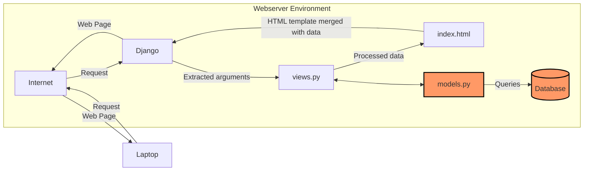

# Amajon

## Link tautan PWS dan masing-masing README.md tugas
Link: http://athallah-damar-amajon.pbp.cs.ui.ac.id/
[README.md Tugas 2](#Tugas-2)
[README.md Tugas 3](#Tugas-3)

## Tugas-2
## Jelaskan bagaimana cara kamu mengimplementasikan checklist di atas secara step-by-step (bukan hanya sekadar mengikuti tutorial).

### Membuat sebuah proyek Django baru
* Jalankan perintah berikut:
```shell
# MEBUAT DIREKTORI
mkdir amajon
cd amajon

# MEMBUAT ENVIRONMENT
python -m venv env

# INSTALL LIBRARIES
env\Script\activate
pip install django
pip install gunicorn
pip install whitenoise
pip install psycopg2-binary
pip install requests
pip install urllib3
pip freeze > requirements.txt
```
* Membuat `.gitignore`
* Membuat project
```
django-admin startproject amajon .
```

###  Membuat aplikasi dengan nama `main` pada proyek tersebut.
```
django-admin startapp main
```
Kemudian, menambahkan `ALLOWED_HOST` dalam `settings.py` agar dapat di _run_ secara lokal
```py
ALLOWED_HOSTS = ["127.0.0.1", "localhost"]
```

### Melakukan routing pada proyek agar dapat menjalankan aplikasi main.
* Menambahkan `main` pada `INSTALLED_APPS` dalam `settings.py`
```py
INSTALLED_APPS = [
...
'main'
]
```
### Membuat model pada aplikasi main dengan nama Product dan memiliki atribut wajib sebagai berikut: nama, price, description
Memodifikasi file `models.py`
```py
from django.db import models

# MENAMBAHKAN KODE DIBAWAH
class Product(models.Model):
    name = models.CharField(max_length=255)
    price = models.IntegerField()
    description = models.TextField()
    quantity = models.IntegerField()

    def __str__(self):
        return print(f"Name: {self.name}, Price: {self.price}, Stock: {self.stock}")
```

### Membuat sebuah fungsi pada `views.py` untuk dikembalikan ke dalam sebuah template HTML yang menampilkan nama aplikasi serta nama dan kelas kamu.
Memodifikasi `views.py`
```py
from django.shortcuts import render

# Create your views here.

def show_main(request):
    context = {
        'app': 'Amajon'
        'name': 'Athallah Damar Jiwanto',
        'class': 'PBP D'
    }

    return render(request, "main.html", context)
```
dan pada HTML menggunakan '{{}}'
```HTML
<!DOCTYPE html>
<html lang="en">
    <meta charset="UTF-8">
    <meta name="viewport" content="width=device-width, initial-scale=1.0">
    <title>Amajon.com</title>
    <h1>{{application_name}}</h1>

    <h5>NPM: </h5>
    <p>{{npm}}</p>
    <h5>Name: </h5>
    <p>{{nama}}</p>
    <h5>Class: </h5>
    <p>{{kelas}}</p>

</html>
```
### Membuat sebuah routing pada `urls.py` aplikasi main untuk memetakan fungsi yang telah dibuat pada `views.py`.
* Modifikasi `urls.py` pada direktori `main`
```py
from django.urls import path
from main.views import show_main

app_name = 'main'

urlpatterns = [
    path('', show_main, name='show_main'),
]
```
* Modifikasi `urls.py` pada direktori proyek
```py
from django.contrib import admin
from django.urls import path,include

urlpatterns = [
    path('admin/', admin.site.urls),
    path('', include('main.urls')),
]
```

### Melakukan deployment ke PWS terhadap aplikasi yang sudah dibuat sehingga nantinya dapat diakses oleh teman-temanmu melalui Internet.
* Kembali ke `settings.py`, menambahkan link sesuai format pws
```py
ALLOWED_HOSTS = ["127.0.0.1", "localhost", "athallah-damar-amajon.pbp.cs.ui.ac.id"]
```
* Menjalankan perintah berikut
```shell
git remote add origin https://github.com/AthallahD/amajon.git
git remote add pws http://pbp.cs.ui.ac.id/athallah.damar/amajon
git add .
git commit -m "init commit"
git branch -M main
git push -u origin main
git branch -M master
git push pws master
```
## Buatlah bagan yang berisi request client ke web aplikasi berbasis Django beserta responnya dan jelaskan pada bagan tersebut kaitan antara urls.py, views.py, models.py, dan berkas html.


_User_ mengirim _request_ melalui Internet, yang diterima oleh Django. Django memprosesnya di `views.py` dan, jika diperlukan, mengambil data dari `models.py` yang terhubung ke database. Lalu, data teresebut _merge_ dengan template HTML. Hasilnya, halaman web yang sudah terisi data dikirim kembali melalui Internet untuk ditampilkan di browser _user_.

## Jelaskan fungsi git dalam pengembangan perangkat lunak!
Fungsi git dalam pengembangan perangkat lunak sendiri adalah sebagai version control system. Fungsi utamanya adalah melacak perubahan kode sehingga dapat menyimpan versi-versi berbeda dari proyek tanpa harus menyimpan file duplikat secara manual.
## Menurut Anda, dari semua framework yang ada, mengapa framework Django dijadikan permulaan pembelajaran pengembangan perangkat lunak?
Framework Django sebagai permulaan pembelajaran adalah karena kemudahan dalam penggunaan terutama dalam penggunaan bahasa pemrograman Python. Selain itu pada Django terdapat banyak sekali fitur "Built-in" yang dapat dieksplor oleh pengguna. Pada Django sendiri, pola yang digunakan adalah MVT atau Model View Template yang membantu membagi tugas dalam aplikasi web dengan terstruktur dan logis.
## Mengapa model pada Django disebut sebagai ORM?
Model pada Django disebut ORM (Object-Relational Mapping) karena berfungsi sebagai penghubung antara objek di dalam kode Python dengan tabel di dalam database relasional. ORM mempermudah pekerjaan user dengan database tanpa perlu menulis SQL secara langsung sehingga user bisa berinteraksi dengan database menggunakan objek Python yang lebih intuitif.

## Tugas-3
## Jelaskan mengapa kita memerlukan data delivery dalam pengimplementasian sebuah platform?
Data delivery sangat penting dalam pengimplementasian platform karena platform modern umumnya melibatkan pertukaran data antara berbagai komponen seperti server, database, dan klien (user interface). Tanpa mekanisme data delivery yang baik, aplikasi tidak akan mampu menyajikan data secara real-time atau sesuai permintaan, yang dapat menyebabkan pengalaman pengguna yang buruk dan kesalahan komunikasi antara berbagai sistem. Data delivery memastikan bahwa data yang tepat sampai ke tujuan yang tepat dengan aman, cepat, dan konsisten.

## Menurutmu, mana yang lebih baik antara XML dan JSON? Mengapa JSON lebih populer dibandingkan XML?
JSON lebih baik untuk kebanyakan aplikasi modern karena beberapa alasan:

- Lebih ringan dan lebih ringkas: JSON menggunakan format yang lebih sederhana dan lebih hemat tempat dibandingkan XML, yang biasanya membutuhkan lebih banyak tag untuk mendefinisikan data.
- Lebih mudah dibaca manusia dan mesin: Struktur JSON mirip dengan objek dalam bahasa pemrograman seperti JavaScript, sehingga lebih mudah dipahami dan diolah oleh developer.
- Lebih cepat diproses: Karena JSON lebih ringan, ini memungkinkan parsing yang lebih cepat, yang sangat penting dalam aplikasi web modern yang membutuhkan kecepatan tinggi. Oleh karena itu, JSON lebih populer dibandingkan XML terutama dalam pengembangan aplikasi web dan API modern.

## Jelaskan fungsi dari method `is_valid()` pada form Django dan mengapa kita membutuhkan method tersebut?
Method `is_valid()` digunakan pada form Django untuk memvalidasi data yang dikirimkan oleh user melalui form. Ketika method ini dipanggil, Django akan:

- Memeriksa apakah semua field dalam form telah diisi sesuai dengan aturan validasi yang telah ditetapkan (misalnya, memastikan bahwa input email berbentuk email, atau bahwa suatu field angka memang diisi dengan angka).
- Mengembalikan True jika data valid, atau False jika ada kesalahan. Method ini penting karena membantu memastikan bahwa data yang dikirimkan user benar sebelum diproses lebih lanjut (misalnya disimpan ke database).

## Mengapa kita membutuhkan `csrf_token` saat membuat form di Django? Apa yang dapat terjadi jika kita tidak menambahkan `csrf_token` pada form Django? Mengapa kita membutuhkan csrf_token saat membuat form di Django? Apa yang dapat terjadi jika kita tidak menambahkan csrf_token pada form Django?
`csrf_token` digunakan untuk melindungi form di Django dari serangan `Cross-Site Request Forgery (CSRF)`. Serangan CSRF adalah jenis serangan di mana penyerang dapat membuat user yang telah login di suatu situs mengirimkan permintaan yang tidak diinginkan ke server. Jika kita tidak menambahkan `csrf_token`:

- Penyerang dapat memanfaatkan kelemahan ini untuk melakukan tindakan yang tidak diinginkan atas nama user tanpa sepengetahuan mereka, misalnya, mengubah pengaturan akun atau melakukan transaksi tanpa persetujuan. Dengan menambahkan csrf_token, setiap form akan memiliki token unik yang harus cocok dengan yang disimpan di sesi user. Ini mencegah penyerang dari mengirimkan permintaan palsu karena mereka tidak akan memiliki token yang valid.

## Jelaskan bagaimana cara kamu mengimplementasikan checklist di atas secara step-by-step
- Membuat `base.html` pada subdirektori bernama `templates` pada direktori root
```HTML

<!DOCTYPE html>
<html lang="en">
  <head>
    <meta charset="UTF-8" />
    <meta name="viewport" content="width=device-width, initial-scale=1.0" />
     
  </head>

  <body>
     
  </body>
</html>
```

- Menambahkan line code pada `settings.py` pada bagian `TEMPLATES` agar `base.html` terbaca
```py
TEMPLATES = [
    {
        'BACKEND': 'django.template.backends.django.DjangoTemplates',
        'DIRS': [BASE_DIR / 'templates'],
        'APP_DIRS': True,
        'OPTIONS': {
            'context_processors': [
                'django.template.context_processors.debug',
                'django.template.context_processors.request',
                'django.contrib.auth.context_processors.auth',
                'django.contrib.messages.context_processors.messages',
            ],
        },
    },
]
```

- Memodifikasi `main.html` pada subdirektori `templates` pada direktori `main` agar bisa meng-extend `base.html`
```HTML


<h1>{{ application_name }}</h1>

<h2>Amajon is one of the largest e-commerce in Indonesia</h2>
<h5>NPM: </h5>
<p>{{ npm }}<p>

<h5>Name:</h5>
<p>{{ nama }}</p>

<h5>Class:</h5>
<p>{{ kelas }}</p>


    <p>Belum ada data product pada toko amajon.</p>

    <table>
    <tr>
        <th>Product Name</th>
        <th>Price</th>
        <th>Description</th>
        <th>Quantity</th>
    </tr>

    
        <tr>
            <td>{{products_entry.name}}</td>
            <td>{{products_entry.price}}</td>
            <td>{{products_entry.description}}</td>
            <td>{{products_entry.quantity}}</td>
        </tr>

</table>


<br />

<a href="">
  <button>Add New Product Entry</button>
</a>

```

- Membuat `forms.py` untuk membuat suatu form dan import form pada `views.py`
```py
from django.forms import ModelForm
from main.models import Product

class ProductForm(ModelForm):
    class Meta:
        model = Product
        fields = ["name", "price", "description", "quantity"]
```

- Menambahkan fungsi pada `views.py` dan memodifikasi fungsi di dalamnya
```py
from django.shortcuts import render, redirect
from main.forms import ProductForm
from main.models import Product
from django.http import HttpResponse
from django.core import serializers

def show_main(request):
    product_entries = Product.objects.all()

    context = {
        'application_name' : 'Amajon',
        'nama': 'Athallah Damar Jiwanto',
        'npm': '2306245024',
        'kelas': 'PBP D',
        'products': product_entries
    }

    return render(request, "main.html", context)

def create_product_entry(request):
    form = ProductForm(request.POST or None)

    if form.is_valid() and request.method == "POST":
        form.save()
        return redirect('main:show_main')

    context = {'form': form}
    return render(request, "create_product_entry.html", context)

def show_xml(request):
    data = Product.objects.all()
    return HttpResponse(serializers.serialize("xml", data), content_type="application/xml")

def show_json(request):
    data = Product.objects.all()
    return HttpResponse(serializers.serialize("json", data), content_type="application/json")

def show_xml_by_id(request, id):
    data = Product.objects.filter(pk=id)
    return HttpResponse(serializers.serialize("xml", data), content_type="application/xml")

def show_json_by_id(request, id):
    data = Product.objects.filter(pk=id)
    return HttpResponse(serializers.serialize("json", data), content_type="application/json")
```

- Membuat `create_product_entry.html` agar dapat menambahkan product
```HTML
 

<h1>Add New Product</h1>

<form method="POST">

<table>
  {{ form.as_table }}
  <tr>
  <td></td>
  <td>
    <input type="submit" value="Add Product Entry" />
  </td>
  </tr>
</table>
</form>


```

- Menambahkan path pada `urls.py`
```py
from django.urls import path
from main.views import show_main, create_product_entry, show_xml, show_json, show_json_by_id, show_xml_by_id

app_name = 'main'

urlpatterns = [
    path('', show_main, name='show_main'),
    path('create-product-entry', create_product_entry, name='create_product_entry'),
    path('xml/', show_xml, name='show_xml'), 
    path('json/', show_json, name='show_json'),
    path('xml/<str:id>', show_xml_by_id, name='show_xml_by_id'),
    path('json/<str:id>', show_json_by_id, name='show_json_by_id'),    
]
```

## Mengakses keempat URL di poin 2 menggunakan `Postman`, membuat screenshot dari hasil akses URL pada Postman, dan menambahkannya ke dalam README.md
- XML

- JSON

- XML by id

- JSON by id
