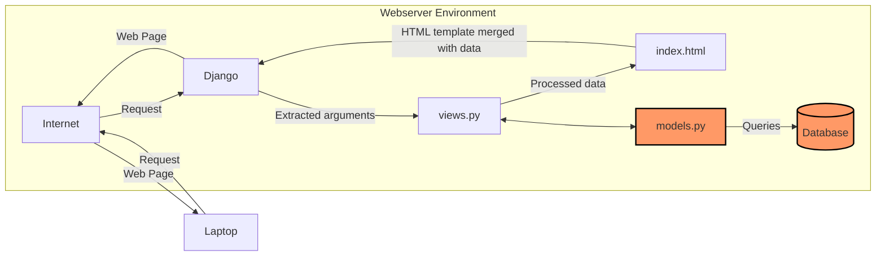

# Amajon
Link: 
## Jelaskan bagaimana cara kamu mengimplementasikan checklist di atas secara step-by-step (bukan hanya sekadar mengikuti tutorial).

### Membuat sebuah proyek Django baru
* Jalankan perintah berikut:
```shell
# MEBUAT DIREKTORI
mkdir amajon
cd amajon

# MEMBUAT ENVIRONMENT
python -m venv env

# INSTALL LIBRARIES
env\Script\activate
pip install django
pip install gunicorn
pip install whitenoise
pip install psycopg2-binary
pip install requests
pip install urllib3
pip freeze > requirements.txt
```
* Membuat `.gitignore`
* Membuat project
```
django-admin startproject amajon .
```

###  Membuat aplikasi dengan nama `main` pada proyek tersebut.
```
django-admin startapp main
```
Kemudian, menambahkan `ALLOWED_HOST` dalam `settings.py` agar dapat di _run_ secara lokal
```py
ALLOWED_HOSTS = ["127.0.0.1", "localhost"]
```

### Melakukan routing pada proyek agar dapat menjalankan aplikasi main.
* Menambahkan `main` pada `INSTALLED_APPS` dalam `settings.py`
```py
INSTALLED_APPS = [
...
'main'
]
```
### Membuat model pada aplikasi main dengan nama Product dan memiliki atribut wajib sebagai berikut: nama, price, description
Memodifikasi file `models.py`
```py
from django.db import models

# MENAMBAHKAN KODE DIBAWAH
class Product(models.Model):
    name = models.CharField(max_length=255)
    price = models.IntegerField()
    description = models.TextField()
    quantity = models.IntegerField()

    def __str__(self):
        return print(f"Name: {self.name}, Price: {self.price}, Stock: {self.stock}")
```

### Membuat sebuah fungsi pada `views.py` untuk dikembalikan ke dalam sebuah template HTML yang menampilkan nama aplikasi serta nama dan kelas kamu.
Memodifikasi `views.py`
```py
from django.shortcuts import render

# Create your views here.

def show_main(request):
    context = {
        'app': 'Amajon'
        'name': 'Athallah Damar Jiwanto',
        'class': 'PBP D'
    }

    return render(request, "main.html", context)
```
dan pada HTML menggunakan '{{}}'
```HTML
<!DOCTYPE html>
<html lang="en">
    <meta charset="UTF-8">
    <meta name="viewport" content="width=device-width, initial-scale=1.0">
    <title>Amajon.com</title>
    <h1>{{application_name}}</h1>

    <h5>NPM: </h5>
    <p>{{npm}}</p>
    <h5>Name: </h5>
    <p>{{nama}}</p>
    <h5>Class: </h5>
    <p>{{kelas}}</p> 
</html>
```
### Membuat sebuah routing pada `urls.py` aplikasi main untuk memetakan fungsi yang telah dibuat pada `views.py`.
* Modifikasi `urls.py` pada direktori `main`
```py
from django.urls import path
from main.views import show_main

app_name = 'main'

urlpatterns = [
    path('', show_main, name='show_main'),
]
```
* Modifikasi `urls.py` pada direktori proyek
```py
from django.contrib import admin
from django.urls import path,include

urlpatterns = [
    path('admin/', admin.site.urls),
    path('', include('main.urls')),
]
```

### Melakukan deployment ke PWS terhadap aplikasi yang sudah dibuat sehingga nantinya dapat diakses oleh teman-temanmu melalui Internet.
* Kembali ke `settings.py`, menambahkan link sesuai format pws
```py
ALLOWED_HOSTS = ["127.0.0.1", "localhost", "athallah-damar-amajon.pbp.cs.ui.ac.id"]
```
* Menjalankan perintah berikut
```shell
git remote add origin https://github.com/AthallahD/amajon.git
git remote add pws http://pbp.cs.ui.ac.id/athallah.damar/amajon
git add .
git commit -m "init commit"
git branch -M main
git push -u origin main
git branch -M master
git push pws master
```
## Buatlah bagan yang berisi request client ke web aplikasi berbasis Django beserta responnya dan jelaskan pada bagan tersebut kaitan antara urls.py, views.py, models.py, dan berkas html.


_User_ mengirim _request_ melalui Internet, yang diterima oleh Django. Django memprosesnya di `views.py` dan, jika diperlukan, mengambil data dari `models.py` yang terhubung ke database. Lalu, data teresebut _merge_ dengan template HTML. Hasilnya, halaman web yang sudah terisi data dikirim kembali melalui Internet untuk ditampilkan di browser _user_.

## Jelaskan fungsi git dalam pengembangan perangkat lunak!
Fungsi git dalam pengembangan perangkat lunak sendiri adalah sebagai version control system. Fungsi utamanya adalah melacak perubahan kode sehingga dapat menyimpan versi-versi berbeda dari proyek tanpa harus menyimpan file duplikat secara manual.
## Menurut Anda, dari semua framework yang ada, mengapa framework Django dijadikan permulaan pembelajaran pengembangan perangkat lunak?
Framework Django sebagai permulaan pembelajaran adalah karena kemudahan dalam penggunaan terutama dalam penggunaan bahasa pemrograman Python. Selain itu pada Django terdapat banyak sekali fitur "Built-in" yang dapat dieksplor oleh pengguna. Pada Django sendiri, pola yang digunakan adalah MVT atau Model View Template yang membantu membagi tugas dalam aplikasi web dengan terstruktur dan logis.
## Mengapa model pada Django disebut sebagai ORM?
Model pada Django disebut ORM (Object-Relational Mapping) karena berfungsi sebagai penghubung antara objek di dalam kode Python dengan tabel di dalam database relasional. ORM mempermudah pekerjaan user dengan database tanpa perlu menulis SQL secara langsung sehingga user bisa berinteraksi dengan database menggunakan objek Python yang lebih intuitif.