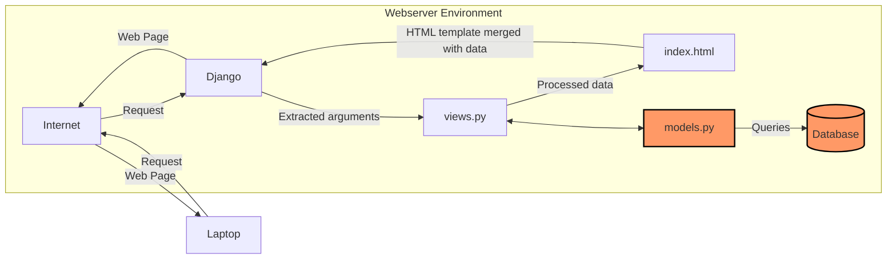
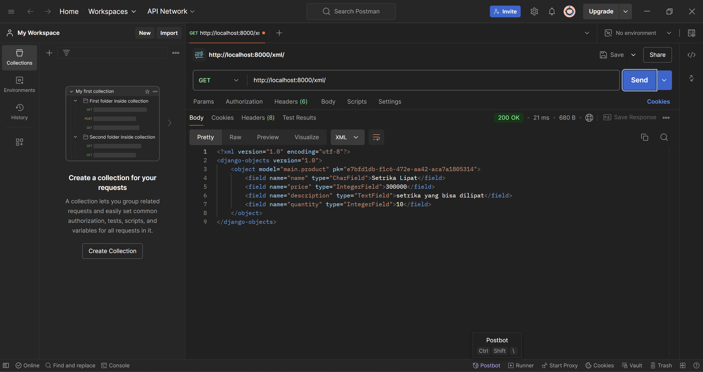
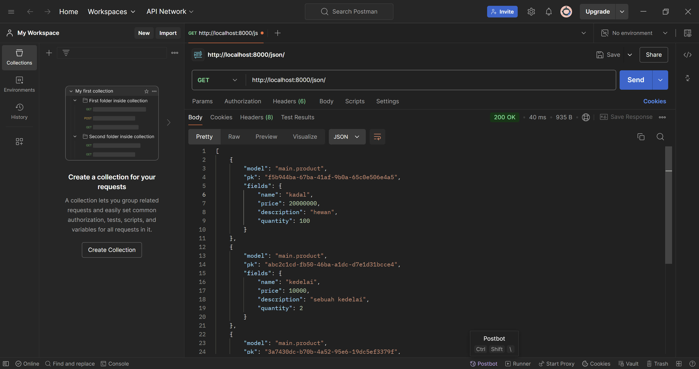

# Amajon

## Link tautan PWS dan masing-masing README.md tugas
- Link: http://athallah-damar-amajon.pbp.cs.ui.ac.id/

- [README.md Tugas 2](#Tugas-2)

- [README.md Tugas 3](#Tugas-3)

- [README.md Tugas 4](#Tugas-4)

- [README.md Tugas 5](#Tugas-5)

- [README.md Tugas 6](#Tugas-6)

# Tugas-2
## Jelaskan bagaimana cara kamu mengimplementasikan checklist di atas secara step-by-step (bukan hanya sekadar mengikuti tutorial).

### Membuat sebuah proyek Django baru
* Jalankan perintah berikut:
```shell
# MEBUAT DIREKTORI
mkdir amajon
cd amajon

# MEMBUAT ENVIRONMENT
python -m venv env

# INSTALL LIBRARIES
env\Script\activate
pip install django
pip install gunicorn
pip install whitenoise
pip install psycopg2-binary
pip install requests
pip install urllib3
pip freeze > requirements.txt
```
* Membuat `.gitignore`
* Membuat project
```
django-admin startproject amajon .
```

###  Membuat aplikasi dengan nama `main` pada proyek tersebut.
```
django-admin startapp main
```
Kemudian, menambahkan `ALLOWED_HOST` dalam `settings.py` agar dapat di _run_ secara lokal
```py
ALLOWED_HOSTS = ["127.0.0.1", "localhost"]
```

### Melakukan routing pada proyek agar dapat menjalankan aplikasi main.
* Menambahkan `main` pada `INSTALLED_APPS` dalam `settings.py`
```py
INSTALLED_APPS = [
...
'main'
]
```
### Membuat model pada aplikasi main dengan nama Product dan memiliki atribut wajib sebagai berikut: nama, price, description
Memodifikasi file `models.py`
```py
from django.db import models

# MENAMBAHKAN KODE DIBAWAH
class Product(models.Model):
    name = models.CharField(max_length=255)
    price = models.IntegerField()
    description = models.TextField()
    quantity = models.IntegerField()

    def __str__(self):
        return print(f"Name: {self.name}, Price: {self.price}, Stock: {self.stock}")
```

### Membuat sebuah fungsi pada `views.py` untuk dikembalikan ke dalam sebuah template HTML yang menampilkan nama aplikasi serta nama dan kelas kamu.
Memodifikasi `views.py`
```py
from django.shortcuts import render

# Create your views here.

def show_main(request):
    context = {
        'app': 'Amajon'
        'name': 'Athallah Damar Jiwanto',
        'class': 'PBP D'
    }

    return render(request, "main.html", context)
```
dan pada HTML menggunakan '{{}}'
```HTML
<!DOCTYPE html>
<html lang="en">
    <meta charset="UTF-8">
    <meta name="viewport" content="width=device-width, initial-scale=1.0">
    <title>Amajon.com</title>
    <h1>{{application_name}}</h1>

    <h5>NPM: </h5>
    <p>{{npm}}</p>
    <h5>Name: </h5>
    <p>{{nama}}</p>
    <h5>Class: </h5>
    <p>{{kelas}}</p>

</html>
```
### Membuat sebuah routing pada `urls.py` aplikasi main untuk memetakan fungsi yang telah dibuat pada `views.py`.
* Modifikasi `urls.py` pada direktori `main`
```py
from django.urls import path
from main.views import show_main

app_name = 'main'

urlpatterns = [
    path('', show_main, name='show_main'),
]
```
* Modifikasi `urls.py` pada direktori proyek
```py
from django.contrib import admin
from django.urls import path,include

urlpatterns = [
    path('admin/', admin.site.urls),
    path('', include('main.urls')),
]
```

### Melakukan deployment ke PWS terhadap aplikasi yang sudah dibuat sehingga nantinya dapat diakses oleh teman-temanmu melalui Internet.
* Kembali ke `settings.py`, menambahkan link sesuai format pws
```py
ALLOWED_HOSTS = ["127.0.0.1", "localhost", "athallah-damar-amajon.pbp.cs.ui.ac.id"]
```
* Menjalankan perintah berikut
```shell
git remote add origin https://github.com/AthallahD/amajon.git
git remote add pws http://pbp.cs.ui.ac.id/athallah.damar/amajon
git add .
git commit -m "init commit"
git branch -M main
git push -u origin main
git branch -M master
git push pws master
```
## Buatlah bagan yang berisi request client ke web aplikasi berbasis Django beserta responnya dan jelaskan pada bagan tersebut kaitan antara urls.py, views.py, models.py, dan berkas html.


_User_ mengirim _request_ melalui Internet, yang diterima oleh Django. Django memprosesnya di `views.py` dan, jika diperlukan, mengambil data dari `models.py` yang terhubung ke database. Lalu, data teresebut _merge_ dengan template HTML. Hasilnya, halaman web yang sudah terisi data dikirim kembali melalui Internet untuk ditampilkan di browser _user_.

## Jelaskan fungsi git dalam pengembangan perangkat lunak!
Fungsi git dalam pengembangan perangkat lunak sendiri adalah sebagai version control system. Fungsi utamanya adalah melacak perubahan kode sehingga dapat menyimpan versi-versi berbeda dari proyek tanpa harus menyimpan file duplikat secara manual.
## Menurut Anda, dari semua framework yang ada, mengapa framework Django dijadikan permulaan pembelajaran pengembangan perangkat lunak?
Framework Django sebagai permulaan pembelajaran adalah karena kemudahan dalam penggunaan terutama dalam penggunaan bahasa pemrograman Python. Selain itu pada Django terdapat banyak sekali fitur "Built-in" yang dapat dieksplor oleh pengguna. Pada Django sendiri, pola yang digunakan adalah MVT atau Model View Template yang membantu membagi tugas dalam aplikasi web dengan terstruktur dan logis.
## Mengapa model pada Django disebut sebagai ORM?
Model pada Django disebut ORM (Object-Relational Mapping) karena berfungsi sebagai penghubung antara objek di dalam kode Python dengan tabel di dalam database relasional. ORM mempermudah pekerjaan user dengan database tanpa perlu menulis SQL secara langsung sehingga user bisa berinteraksi dengan database menggunakan objek Python yang lebih intuitif.

# Tugas-3
## Jelaskan mengapa kita memerlukan data delivery dalam pengimplementasian sebuah platform?
Data delivery sangat penting dalam pengimplementasian platform karena platform modern umumnya melibatkan pertukaran data antara berbagai komponen seperti server, database, dan klien (user interface). Tanpa mekanisme data delivery yang baik, aplikasi tidak akan mampu menyajikan data secara real-time atau sesuai permintaan, yang dapat menyebabkan pengalaman pengguna yang buruk dan kesalahan komunikasi antara berbagai sistem. Data delivery memastikan bahwa data yang tepat sampai ke tujuan yang tepat dengan aman, cepat, dan konsisten.

## Menurutmu, mana yang lebih baik antara XML dan JSON? Mengapa JSON lebih populer dibandingkan XML?
JSON lebih baik untuk kebanyakan aplikasi modern karena beberapa alasan:

- Lebih ringan dan lebih ringkas: JSON menggunakan format yang lebih sederhana dan lebih hemat tempat dibandingkan XML, yang biasanya membutuhkan lebih banyak tag untuk mendefinisikan data.
- Lebih mudah dibaca manusia dan mesin: Struktur JSON mirip dengan objek dalam bahasa pemrograman seperti JavaScript, sehingga lebih mudah dipahami dan diolah oleh developer.
- Lebih cepat diproses: Karena JSON lebih ringan, ini memungkinkan parsing yang lebih cepat, yang sangat penting dalam aplikasi web modern yang membutuhkan kecepatan tinggi. Oleh karena itu, JSON lebih populer dibandingkan XML terutama dalam pengembangan aplikasi web dan API modern.

## Jelaskan fungsi dari method `is_valid()` pada form Django dan mengapa kita membutuhkan method tersebut?
Method `is_valid()` digunakan pada form Django untuk memvalidasi data yang dikirimkan oleh user melalui form. Ketika method ini dipanggil, Django akan:

- Memeriksa apakah semua field dalam form telah diisi sesuai dengan aturan validasi yang telah ditetapkan (misalnya, memastikan bahwa input email berbentuk email, atau bahwa suatu field angka memang diisi dengan angka).
- Mengembalikan True jika data valid, atau False jika ada kesalahan. Method ini penting karena membantu memastikan bahwa data yang dikirimkan user benar sebelum diproses lebih lanjut (misalnya disimpan ke database).

## Mengapa kita membutuhkan `csrf_token` saat membuat form di Django? Apa yang dapat terjadi jika kita tidak menambahkan `csrf_token` pada form Django? Mengapa kita membutuhkan csrf_token saat membuat form di Django? Apa yang dapat terjadi jika kita tidak menambahkan csrf_token pada form Django?
`csrf_token` digunakan untuk melindungi form di Django dari serangan `Cross-Site Request Forgery (CSRF)`. Serangan CSRF adalah jenis serangan di mana penyerang dapat membuat user yang telah login di suatu situs mengirimkan permintaan yang tidak diinginkan ke server. Jika kita tidak menambahkan `csrf_token`:

- Penyerang dapat memanfaatkan kelemahan ini untuk melakukan tindakan yang tidak diinginkan atas nama user tanpa sepengetahuan mereka, misalnya, mengubah pengaturan akun atau melakukan transaksi tanpa persetujuan. Dengan menambahkan csrf_token, setiap form akan memiliki token unik yang harus cocok dengan yang disimpan di sesi user. Ini mencegah penyerang dari mengirimkan permintaan palsu karena mereka tidak akan memiliki token yang valid.

## Jelaskan bagaimana cara kamu mengimplementasikan checklist di atas secara step-by-step
- Membuat `base.html` pada subdirektori bernama `templates` pada direktori root
```HTML

<!DOCTYPE html>
<html lang="en">
  <head>
    <meta charset="UTF-8" />
    <meta name="viewport" content="width=device-width, initial-scale=1.0" />
     
  </head>

  <body>
     
  </body>
</html>
```

- Menambahkan line code pada `settings.py` pada bagian `TEMPLATES` agar `base.html` terbaca
```py
TEMPLATES = [
    {
        'BACKEND': 'django.template.backends.django.DjangoTemplates',
        'DIRS': [BASE_DIR / 'templates'],
        'APP_DIRS': True,
        'OPTIONS': {
            'context_processors': [
                'django.template.context_processors.debug',
                'django.template.context_processors.request',
                'django.contrib.auth.context_processors.auth',
                'django.contrib.messages.context_processors.messages',
            ],
        },
    },
]
```

- Memodifikasi `main.html` pada subdirektori `templates` pada direktori `main` agar bisa meng-extend `base.html`
```HTML


<h1>{{ application_name }}</h1>

<h2>Amajon is one of the largest e-commerce in Indonesia</h2>
<h5>NPM: </h5>
<p>{{ npm }}<p>

<h5>Name:</h5>
<p>{{ nama }}</p>

<h5>Class:</h5>
<p>{{ kelas }}</p>


    <p>Belum ada data product pada toko amajon.</p>

    <table>
    <tr>
        <th>Product Name</th>
        <th>Price</th>
        <th>Description</th>
        <th>Quantity</th>
    </tr>

    
        <tr>
            <td>{{products_entry.name}}</td>
            <td>{{products_entry.price}}</td>
            <td>{{products_entry.description}}</td>
            <td>{{products_entry.quantity}}</td>
        </tr>

</table>


<br />

<a href="">
  <button>Add New Product Entry</button>
</a>

```

- Membuat `forms.py` untuk membuat suatu form dan import form pada `views.py`
```py
from django.forms import ModelForm
from main.models import Product

class ProductForm(ModelForm):
    class Meta:
        model = Product
        fields = ["name", "price", "description", "quantity"]
```

- Menambahkan fungsi pada `views.py` dan memodifikasi fungsi di dalamnya
```py
from django.shortcuts import render, redirect
from main.forms import ProductForm
from main.models import Product
from django.http import HttpResponse
from django.core import serializers

def show_main(request):
    product_entries = Product.objects.all()

    context = {
        'application_name' : 'Amajon',
        'nama': 'Athallah Damar Jiwanto',
        'npm': '2306245024',
        'kelas': 'PBP D',
        'products': product_entries
    }

    return render(request, "main.html", context)

def create_product_entry(request):
    form = ProductForm(request.POST or None)

    if form.is_valid() and request.method == "POST":
        form.save()
        return redirect('main:show_main')

    context = {'form': form}
    return render(request, "create_product_entry.html", context)

def show_xml(request):
    data = Product.objects.all()
    return HttpResponse(serializers.serialize("xml", data), content_type="application/xml")

def show_json(request):
    data = Product.objects.all()
    return HttpResponse(serializers.serialize("json", data), content_type="application/json")

def show_xml_by_id(request, id):
    data = Product.objects.filter(pk=id)
    return HttpResponse(serializers.serialize("xml", data), content_type="application/xml")

def show_json_by_id(request, id):
    data = Product.objects.filter(pk=id)
    return HttpResponse(serializers.serialize("json", data), content_type="application/json")
```

- Membuat `create_product_entry.html` agar dapat menambahkan product
```HTML
 

<h1>Add New Product</h1>

<form method="POST">

<table>
  {{ form.as_table }}
  <tr>
  <td></td>
  <td>
    <input type="submit" value="Add Product Entry" />
  </td>
  </tr>
</table>
</form>


```

- Menambahkan path pada `urls.py`
```py
from django.urls import path
from main.views import show_main, create_product_entry, show_xml, show_json, show_json_by_id, show_xml_by_id

app_name = 'main'

urlpatterns = [
    path('', show_main, name='show_main'),
    path('create-product-entry', create_product_entry, name='create_product_entry'),
    path('xml/', show_xml, name='show_xml'), 
    path('json/', show_json, name='show_json'),
    path('xml/<str:id>', show_xml_by_id, name='show_xml_by_id'),
    path('json/<str:id>', show_json_by_id, name='show_json_by_id'),    
]
```

## Mengakses keempat URL di poin 2 menggunakan `Postman`, membuat screenshot dari hasil akses URL pada Postman, dan menambahkannya ke dalam README.md
- XML

- JSON

- XML by id

- JSON by id


# Tugas-4
## Apa perbedaan antara `HttpResponseRedirect()` dan `redirect()`
1. `HttpsResponseRedirect()`
- Fungsi: HttpResponseRedirect adalah sebuah class di Django yang digunakan untuk melakukan redirect secara manual dengan menentukan URL tujuan sebagai parameter.
- Cara Kerja: menyediakan URL tujuan secara eksplisit, baik sebagai string atau URL yang dibentuk dari fungsi lain.
- Contoh Penggunaan :
```py
def login_user(request):
   if request.method == 'POST':
      form = AuthenticationForm(data=request.POST)

      if form.is_valid():
        user = form.get_user()
        login(request, user)
        response = HttpResponseRedirect(reverse("main:show_main"))
        response.set_cookie('last_login', str(datetime.datetime.now()))
        return response

   else:
      form = AuthenticationForm(request)
   context = {'form': form}
   return render(request, 'login.html', context)
```
dengan `(reverse("main:show_main"))` sebagai URL tujuan

2. `redirect()`
- Fungsi: redirect() adalah shortcut (fungsi bawaan Django) yang lebih mudah digunakan dibandingkan HttpResponseRedirect. Selain menerima URL tujuan, redirect() juga dapat menerima nama view atau model instance, yang kemudian akan diubah secara otomatis menjadi URL yang tepat.
- Cara Kerja: Lebih fleksibel karena dapat memberikan view name, model object, atau URL secara langsung.
- Contoh penggunaan :
```py
def register(request):
    form = UserCreationForm()

    if request.method == "POST":
        form = UserCreationForm(request.POST)
        if form.is_valid():
            form.save()
            messages.success(request, 'Your account has been successfully created!')
            return redirect('main:login')
    context = {'form':form}
    return render(request, 'register.html', context)
```
dengan `"main:login"` sebagai URL tujuan

## Jelaskan cara kerja penghubungan model `Product` dengan `User`!
`Product` diberikan attribute ForeignKey `User` sehingga tercipta hubungan _Many to One_. `User` pada Django didapatkan dari models package `django.contrib.auth.models`. Untuk melakukan filtering pada object `Product`, tambahkan kode berikut :
```py
class Product(models.Model):
    user = models.ForeignKey(User, on_delete=models.CASCADE)
```

## Apa perbedaan antara authentication dan authorization, apakah yang dilakukan saat pengguna login? Jelaskan bagaimana Django mengimplementasikan kedua konsep tersebut.
1. `Authentication` (Otentikasi)
- Definisi : Authentication adalah proses memverifikasi identitas pengguna. Ini melibatkan memastikan bahwa pengguna adalah siapa yang mereka klaim, biasanya dengan memeriksa kredensial seperti username dan password.
- Contoh : Saat pengguna memasukkan username dan password untuk masuk ke suatu aplikasi, aplikasi tersebut memeriksa apakah kredensial tersebut benar dan sesuai dengan yang ada di database.

2. `Authorization` (Otorisasi)
- Definisi: Authorization adalah proses memeriksa hak akses pengguna. Setelah pengguna terotentikasi, otorisasi menentukan apakah mereka memiliki izin untuk mengakses sumber daya atau melakukan tindakan tertentu.
- Contoh: Setelah pengguna login, sistem kemudian memeriksa apakah pengguna tersebut memiliki izin untuk melihat halaman admin atau melakukan tindakan seperti mengedit, menghapus data, dsb.

### Perbedaan Utama
- `Authentication` berkaitan dengan memverifikasi identitas pengguna
- `Authorization` berkaitan dengan memeriksa izin setelah diidentifikasi

### Proses saat login
- Authentication (Otentikasi): Aplikasi memeriksa kredensial yang dimasukkan (seperti username dan password) dengan data yang ada di database untuk memverifikasi identitas pengguna.
- Jika identitas terverifikasi, pengguna kemudian diotentikasi, yang artinya sistem mengenali siapa pengguna itu.
- Setelah pengguna terotentikasi, aplikasi dapat melakukan authorization (otorisasi) dengan memeriksa apakah pengguna tersebut memiliki izin yang diperlukan untuk mengakses sumber daya tertentu.

### Implementasi pada Django
#### `Authentication` (Otentikasi) di Django:
- Django menggunakan User model bawaan untuk mengelola pengguna.
- Proses otentikasi biasanya dilakukan melalui sistem login, di mana Django memeriksa apakah pengguna dengan username dan password yang diberikan ada dan kredensialnya benar.
- Fungsi authenticationForm() memiliki tujuan yang sama dengan authenticate() namun
perbedaannya ada di import dan khusus digunakan untuk otentikasi form digunakan untuk memeriksa kredensial :
```py
def login_user(request):
   if request.method == 'POST':
      form = AuthenticationForm(data=request.POST)

      if form.is_valid():
        user = form.get_user()
        login(request, user)
        response = HttpResponseRedirect(reverse("main:show_main"))
        response.set_cookie('last_login', str(datetime.datetime.now()))
        return response

   else:
      form = AuthenticationForm(request)
   context = {'form': form}
   return render(request, 'login.html', context)
```
#### `Authorization` (Otorisasi) di Django :
- Django menggunakan permissions dan groups untuk otorisasi. Permissions mengontrol apa yang bisa dilakukan pengguna, seperti can_add, can_change, dan can_delete untuk objek tertentu.
- Django juga memiliki mekanisme otorisasi berbasis objek, di mana akses dapat diberikan berdasarkan kepemilikan atau kriteria lain.
- Decorator @login_required: Django menyediakan decorator yang memastikan bahwa hanya pengguna yang sudah terotentikasi yang dapat mengakses view tertentu.
```py
@login_required(login_url='/login')
```
## Bagaimana Django mengingat pengguna yang telah login? Jelaskan kegunaan lain dari cookies dan apakah semua cookies aman digunakan?

Django menggunakan session dan cookies untuk mengingat pengguna yang telah login. Proses ini dapat dijelaskan dalam beberapa langkah:
1. Login dan Otentikasi
- Ketika pengguna login menggunakan kredensial mereka (username dan password), Django memverifikasi kredensial tersebut menggunakan mekanisme otentikasi, seperti `authenticate()` dan `login()`. Jika kredensialnya benar, pengguna dianggap terotentikasi.
2. Session dan Cookies
- Setelah login berhasil, Django membuat session untuk pengguna. Session ini adalah penyimpanan sementara di server yang digunakan untuk melacak informasi tentang pengguna selama sesi (misalnya, pengguna telah login).
- Django kemudian mengirimkan sebuah cookie ke browser pengguna. Cookie ini berisi session ID yang unik dan bertindak sebagai referensi antara pengguna dan session mereka di server.
3. Penyimpanan session
- Session ID yang terkandung dalam cookie adalah kunci untuk mencocokkan pengguna dengan session yang tersimpan di server. Django dapat menyimpan data session di berbagai tempat, seperti dalam database, file, atau cache.
- Setiap kali pengguna mengirim permintaan baru ke server (misalnya, membuka halaman baru setelah login), Django akan memeriksa cookie yang dikirim oleh browser. Jika cookie tersebut valid dan cocok dengan session di server, pengguna dianggap telah login dan Django akan "mengingat" mereka.
4. `login()` dan `logout()`
- Fungsi `login()` Django mengaitkan session dengan pengguna. Ini berarti Django akan menyimpan informasi pengguna yang terotentikasi dalam session dan mengirimkan session ID kembali ke browser dalam bentuk cookie.
- Fungsi `logout()` digunakan untuk menghapus session dan cookie dari pengguna sehingga mereka tidak lagi dianggap login.

### Kegunaan lain cookies
Cookies memiliki berbagai kegunaan dalam pengembangan web selain untuk mengelola session pengguna yang telah login:

1. Menyimpan Preferensi Pengguna: Cookies bisa digunakan untuk menyimpan preferensi pengguna, seperti pengaturan bahasa, tema, atau preferensi lain yang terkait dengan pengalaman pengguna.

2. Pelacakan Pengguna (Tracking): Cookies sering digunakan oleh layanan analitik atau pengiklan untuk melacak aktivitas pengguna di berbagai situs web. Ini memungkinkan pengumpulan data mengenai kebiasaan dan perilaku pengguna di internet.

3. Otentikasi Berkelanjutan (Remember Me): Cookies juga digunakan untuk menyimpan informasi login yang bersifat persisten (misalnya, opsi "Ingat Saya"). Dengan cara ini, pengguna tidak perlu login setiap kali mengunjungi situs.

4. Personalisasi Iklan: Cookies sering digunakan oleh pengiklan untuk menargetkan iklan yang sesuai dengan preferensi dan aktivitas online pengguna. Ini berdasarkan data yang dikumpulkan dari riwayat penjelajahan pengguna.

### Apakah semua cookies aman digunakan?
Tidak semua cookies aman, dan ada beberapa risiko serta perhatian terkait keamanan cookies:

1. Cookie yang Aman (Secure Cookies):

- Django menyediakan opsi untuk membuat secure cookies, yaitu cookies yang hanya akan dikirim melalui koneksi HTTPS. Ini mengurangi risiko penyadapan (sniffing) oleh pihak ketiga.
- Penggunaan flag Secure pada cookie memastikan bahwa cookie hanya dikirim melalui koneksi yang aman.
- Flag HttpOnly membuat cookie tidak bisa diakses oleh JavaScript, sehingga melindungi cookie dari serangan cross-site scripting (XSS).

2. Cross-Site Scripting (XSS):

- Cookies yang tidak aman bisa dicuri melalui serangan XSS. Ini terjadi jika attacker berhasil memasukkan skrip berbahaya ke dalam situs yang kemudian bisa mengakses cookie pengguna. Menggunakan flag `HttpOnly` bisa mencegah serangan ini.

3. Cross-Site Request Forgery (CSRF):

- CSRF adalah serangan di mana attacker memanipulasi pengguna yang terotentikasi untuk melakukan aksi yang tidak mereka kehendaki. Django melindungi dari CSRF dengan menggunakan token CSRF di form, tetapi cookies bisa digunakan untuk meluncurkan serangan CSRF jika tidak diatur dengan baik.

4. Session Hijacking:

- Jika attacker mencuri session ID (biasanya dari cookie), mereka dapat mengakses session pengguna dan bertindak seolah-olah mereka adalah pengguna tersebut. Oleh karena itu, penting untuk mengamankan cookie yang berisi session ID.

5. Cookie Expiration:

- Cookies bisa disetel agar memiliki masa kadaluarsa. Cookie yang tidak memiliki masa kadaluarsa yang tepat bisa disalahgunakan oleh attacker.

## Jelaskan bagaimana cara kamu mengimplementasikan checklist di atas secara step-by-step (bukan hanya sekadar mengikuti tutorial).

### Implementasi _Authentication_ pada `views`
- Menambahkan beberapa imports
```py
import datetime
from django.shortcuts import render, redirect
from main.forms import ProductForm
from main.models import Product
from django.http import HttpResponse
from django.core import serializers
from django.contrib.auth.forms import UserCreationForm, AuthenticationForm
from django.contrib import messages
from django.contrib.auth import login, logout, authenticate, logout
from django.contrib.auth.decorators import login_required
from django.http import HttpResponseRedirect
from django.urls import reverse
```
- Menambahkan Method `Register`, `login`, `logout`
```py
def register(request):
    form = UserCreationForm()

    if request.method == "POST":
        form = UserCreationForm(request.POST)
        if form.is_valid():
            form.save()
            messages.success(request, 'Your account has been successfully created!')
            return redirect('main:login')
    context = {'form':form}
    return render(request, 'register.html', context)

def login_user(request):
   if request.method == 'POST':
      form = AuthenticationForm(data=request.POST)

      if form.is_valid():
        user = form.get_user()
        login(request, user)
        response = HttpResponseRedirect(reverse("main:show_main"))
        response.set_cookie('last_login', str(datetime.datetime.now()))
        return response

   else:
      form = AuthenticationForm(request)
   context = {'form': form}
   return render(request, 'login.html', context)

def logout_user(request):
    logout(request)
    response = HttpResponseRedirect(reverse('main:login'))
    response.delete_cookie('last_login')
    return response
```
- Meng-Update `show_main` dan `create_product_entry`
```py
def show_main(request):
    product_entries = Product.objects.filter(user=request.user)

    context = {
        'application_name' : 'Amajon',
        'nama': request.user.username,
        'npm': '2306245024',
        'kelas': 'PBP D',
        'products': product_entries,
        'last_login': request.COOKIES.get('last_login'),
    }

    return render(request, "main.html", context)

def create_product_entry(request):
    form = ProductForm(request.POST or None)

    if form.is_valid() and request.method == "POST":
        product_entry = form.save(commit=False)
        product_entry.user = request.user
        product_entry.save()
        return redirect('main:show_main')

    context = {'form': form}
    return render(request, "create_product_entry.html", context)
```
- Membuat templates `login.html` dan `logout.html`
```HTML



<title>Register Your Account</title>




<div class="login">
  <h1>Register</h1>

  <form method="POST">
    
    <table>
      {{ form.as_table }}
      <tr>
        <td></td>
        <td><input type="submit" name="submit" value="Daftar" /></td>
      </tr>
    </table>
  </form>

  
  <ul>
    
    <li>{{ message }}</li>
    
  </ul>
  
</div>


```
```HTML



<title>Login</title>



<div class="login">
  <h1>Login</h1>

  <form method="POST" action="">
    
    <table>
      {{ form.as_table }}
      <tr>
        <td></td>
        <td><input class="btn login_btn" type="submit" value="Login" /></td>
      </tr>
    </table>
  </form>

  
  <ul>
    
    <li>{{ message }}</li>
    
  </ul>
   Don't have an account yet?
  <a href="">Register Now</a>
</div>


```
- Menghubungkan `Product` dengan `User` melalui `models.py`
```py
class Product(models.Model):
    user = models.ForeignKey(User, on_delete=models.CASCADE) # Tambahan Line
    id = models.UUIDField(primary_key=True, default=uuid.uuid4, editable=False)
    name = models.CharField(max_length=255)
    price = models.IntegerField()
    description = models.TextField()
    quantity = models.IntegerField()

    def __str__(self):
        return print(f"Name: {self.name}, Price: {self.price}, Stock: {self.stock}")
```
### Authorization
Mengharuskan user untuk login terlebih dahulu sebelum masuk ke dalam homepage, sehingga kita harus menambahkan decorators `@login_required` dari `django.contrib.auth.decorators` pada `views.py` diatas method `show_main`
```py
@login_required(login_url='/login') # Authorization
def show_main(request):
```
### Finishing
Tambahkan endpoints url pada `urlpatterns` pada `urls.py` yang terletak pada folder `main`
```py
from django.urls import path
from main.views import show_main, create_product_entry, show_xml, show_json, show_json_by_id, show_xml_by_id, register, login_user, logout_user

app_name = 'main'

urlpatterns = [
    path('', show_main, name='show_main'),
    path('create-product-entry', create_product_entry, name='create_product_entry'),
    path('xml/', show_xml, name='show_xml'), 
    path('json/', show_json, name='show_json'),
    path('xml/<str:id>', show_xml_by_id, name='show_xml_by_id'),
    path('json/<str:id>', show_json_by_id, name='show_json_by_id'),
    path('register/', register, name='register'),
    path('login/', login_user, name='login'),
    path('logout/', logout_user, name='logout')
]
```
# Tugas-5
## Jika terdapat beberapa CSS selector untuk suatu elemen HTML, jelaskan urutan prioritas pengambilan CSS selector tersebut!
1. Inline Style
```HTML
<div style="color: red;">Contoh Inline Style</div>
```
2. ID Selector
```HTML
<body>
  <div id="header">
    <h1>ID Header</h1>
  </div>
  ...
</body>
```
```css
#header {
  background-color: #a3b90e;
  margin-top: 0;
  padding: 20px 20px 20px 40px;
}
```
3. Class, Pseudo-class, dan attribute selector
```css
.content_section {
  background-color: #112a33;
  margin-bottom: 30px;
  color: #0F0F0F;
  font-family: cursive;
  padding: 20px 20px 20px 40px;
}
```
4. Type Selector
```css
p {
  color: black;
}
```
5. Universal Selector
```css
* {
  margin: 0;
  padding: 0;
}
```
## Mengapa responsive design menjadi konsep yang penting dalam pengembangan aplikasi web? Berikan contoh aplikasi yang sudah dan belum menerapkan responsive design!
Responsive design adalah konsep dalam pengembangan web yang memungkinkan tampilan sebuah aplikasi atau situs web untuk beradaptasi dengan berbagai ukuran layar dan perangkat. Ini termasuk layar smartphone, tablet, laptop, dan desktop. Seiring dengan berkembangnya penggunaan perangkat mobile, pentingnya responsive design menjadi semakin menonjol.

Berikut adalah beberapa alasan mengapa responsive design sangat penting:

1. **Meningkatkan Pengalaman Pengguna (User Experience)**
Pengguna saat ini mengakses web melalui berbagai perangkat, dari smartphone hingga desktop dengan berbagai ukuran layar. Responsive design memastikan bahwa pengalaman pengguna tetap optimal di semua perangkat, memberikan kenyamanan dalam hal navigasi, kecepatan, dan aksesibilitas. Misalnya, pada layar kecil, elemen-elemen yang besar seperti tombol dan teks yang mudah dibaca sangat penting untuk mencegah pengguna harus memperbesar layar (zoom in/out) secara manual.

2. **Optimasi SEO (Search Engine Optimization)**
Google dan mesin pencari lainnya memprioritaskan situs web yang mobile-friendly dan responsive dalam hasil pencarian mereka. Pada 2015, Google memperkenalkan algoritma mobile-first indexing, yang berarti bahwa versi mobile dari sebuah situs web digunakan sebagai basis untuk menentukan peringkat SEO. Jika situs tidak responsive, ada kemungkinan besar ia akan mendapat peringkat yang lebih rendah di hasil pencarian.

3. **Mengurangi Biaya dan Waktu Pengembangan**
Dengan responsive design, pengembang web hanya perlu membuat satu versi situs web yang bisa berfungsi di berbagai perangkat. Ini berbeda dengan pendekatan lama, di mana diperlukan pengembangan terpisah untuk versi desktop dan versi mobile. Selain itu, perawatan dan update juga lebih mudah karena semua perubahan diterapkan hanya di satu tempat.

4. **Menjangkau Lebih Banyak Pengguna**
Jumlah pengguna perangkat mobile semakin meningkat. Pada 2023, lebih dari 60% akses internet global berasal dari perangkat mobile. Dengan situs web atau aplikasi yang responsive, perusahaan atau pengembang dapat menjangkau lebih banyak pengguna, baik yang mengakses melalui desktop maupun mobile.

5. **Meningkatkan Konversi dan Engagement**
Situs web yang tidak responsive sering kali membuat pengguna frustasi karena tampilan yang tidak rapi, elemen yang tidak dapat diakses dengan baik, atau kecepatan loading yang lambat. Akibatnya, pengguna cenderung meninggalkan situs tersebut. Sebaliknya, dengan desain yang responsive, pengguna lebih cenderung tetap berada di situs lebih lama, yang dapat meningkatkan peluang konversi atau engagement (seperti penjualan atau langganan).

### Contoh Aplikasi yang telah dan belum menerapkan Responsive Design
#### Yang Sudah
1. Airbnb
2. Spotify
3. Netflix
#### Yang Belum
1. Craiglist
2. Web Pemerintah Jogja (jogjakota.id)

## Jelaskan perbedaan antara margin, border, dan padding, serta cara untuk mengimplementasikan ketiga hal tersebut!
Margin, border, dan padding adalah tiga konsep penting dalam CSS Box Model yang digunakan untuk mengatur tata letak dan ruang di sekitar elemen HTML pada sebuah halaman web. Setiap elemen di halaman web memiliki kotak yang terdiri dari empat bagian: konten, padding, border, dan margin.


```css
div {
  margin: 20px; /* Jarak elemen ini dengan elemen lain */
  border: 2px solid black; /* Border hitam solid di sekitar elemen */
  padding: 15px; /* Jarak antara konten dan border */
}
```
## Jelaskan konsep flex box dan grid layout beserta kegunaannya!
Flexbox dan Grid Layout adalah dua sistem tata letak (layout) dalam CSS yang digunakan untuk merancang halaman web yang responsif, dinamis, dan fleksibel. Keduanya memungkinkan pengembang web untuk mengatur elemen di dalam container dengan lebih mudah dan lebih rapi dibandingkan dengan metode lama, seperti float atau positioning.
### Flexbox
**Kegunaan Flexbox:**
- Susunan horizontal atau vertikal yang fleksibel: Cocok untuk menyusun navigasi, toolbar, atau form yang membutuhkan elemen yang fleksibel.
- Responsif dan dinamis: Flexbox membuat tata letak yang mudah menyesuaikan ukuran jendela atau layar perangkat.
- Sederhana dan cepat: Ideal untuk tata letak sederhana dengan satu dimensi (baris atau kolom).
### Grid Layout
**Kegunaan Grid Layout:**
- Tata letak dua dimensi: Ideal untuk tata letak halaman yang kompleks yang melibatkan beberapa baris dan kolom, seperti dashboard, halaman majalah, galeri gambar, dan lain-lain.
- Pengendalian lebih detail: Grid memberikan kontrol penuh terhadap posisi dan ukuran grid items, memungkinkan desain yang lebih kompleks dan terstruktur.
- Responsif dengan fraksi: Grid menggunakan fraksi (fr) untuk mengukur kolom atau baris berdasarkan bagian dari ruang yang tersedia, sehingga lebih fleksibel dan responsif.
## Jelaskan bagaimana cara kamu mengimplementasikan checklist di atas secara step-by-step (bukan hanya sekadar mengikuti tutorial)!
1. Menambahkan dan routing logic `edit_product` pada `views.py` dan `urls.py` di folder `main`
```py
def edit_product(request, id):
    product = Product.objects.get(pk = id)
    form = ProductForm(request.POST or None, instance = product)

    if form.is_valid() and request.method == "POST":
        form.save()
        return HttpResponseRedirect(reverse('main:show_main'))
    
    context = {'form' : form}
    return render(request, "edit_product.html", context)
```
```py
path('edit-product/<uuid:id>', edit_product, name='edit_product')
```
2. Menambahkan dan routing logic `delete_product` pada `views.py` dan `urls.py` di folder `main`
```py
def delete_product(request, id):
    product = Product.objects.get(pk = id)
    product.delete()
    return HttpResponseRedirect(reverse('main:show_main'))
```
```py
path('delete-product/<uuid:id>', delete_product, name='delete_product')
```
3. Menambahkan link Tailwind basa `base.html`
```HTML

<!DOCTYPE html>
<html lang="en">
  <head>
    
    <meta charset="UTF-8" />
    <meta name="viewport" content="width=device-width, initial-scale=1.0" />
    
    <script src="https://cdn.tailwindcss.com"></script>
    <link rel="stylesheet" href=""/>
  </head>
  <body>
     
  </body>
</html>
```
4. Menambahkan MiddleWare dan Static pada `settings.py`
```py
MIDDLEWARE = [
    'django.middleware.security.SecurityMiddleware',
    'whitenoise.middleware.WhiteNoiseMiddleware',
    ...
]
```
```py
STATIC_URL = '/static/'
if DEBUG:
    STATICFILES_DIRS = [
        BASE_DIR / 'static'
    ]
else:
    STATIC_ROOT = BASE_DIR / 'static'
```
5. Membuat folder `static` pada root folder project dan menambahkan 2 folder yaitu `css` dan `images` serta menambahkan `global.css` dan isi file tsb
```css
.form-style form input, form textarea, form select {
    width: 100%;
    padding: 0.5rem;
    border: 2px solid #bcbcbc;
    border-radius: 0.375rem;
}
.form-style form input:focus, form textarea:focus, form select:focus {
    outline: none;
    border-color: #674ea7;
    box-shadow: 0 0 0 3px #674ea7;
}
@keyframes shine {
    0% { background-position: -200% 0; }
    100% { background-position: 200% 0; }
}
.animate-shine {
    background: linear-gradient(120deg, rgba(255, 255, 255, 0.3), rgba(255, 255, 255, 0.1) 50%, rgba(255, 255, 255, 0.3));
    background-size: 200% 100%;
    animation: shine 3s infinite;
}
```
Dengan mengsetup hal-hal diatas, step selanjutnya yaitu menambahkan styling pada halaman login, register, dan main. Pada halaman main, Lalu menambahkan juga card (`card_info.html` dan `card_product.html`) agar halaman lebih menarik. Dan pada langkah terakhir, saya menambahkan navbar dengan responsive design dan mengincludenya pada `main.html`, `create_product.html`, dan `edit_product.html`.

# Tugas-6
## Jelaskan manfaat dari penggunaan JavaScript dalam pengembangan aplikasi web!
Penggunaan JavaScript dalam pengembangan aplikasi web memberikan banyak manfaat, terutama karena JavaScript adalah bahasa pemrograman yang dapat berjalan di sisi klien (client-side). Berikut adalah penjelasan detail tentang beberapa manfaat utama JavaScript dalam pengembangan aplikasi web:

1. Interaktivitas
JavaScript memungkinkan pengembang untuk membuat aplikasi web yang interaktif. Pengguna bisa langsung berinteraksi dengan halaman web tanpa perlu memuat ulang seluruh halaman. Contoh penggunaan yang umum meliputi:

- Validasi form secara langsung (real-time validation).
- Menampilkan atau menyembunyikan elemen halaman web berdasarkan aksi pengguna.
- Pembaruan konten halaman tanpa refresh (misalnya, menggunakan teknik seperti AJAX).

2. Kecepatan dan Responsivitas
Karena JavaScript berjalan langsung di browser pengguna (client-side), tindakan yang melibatkan JavaScript dapat dieksekusi dengan sangat cepat, tanpa perlu komunikasi dengan server. Ini membuat pengalaman pengguna menjadi lebih responsif, karena:

- Proses dapat dieksekusi di perangkat pengguna.
- Waktu pemuatan ulang halaman web dapat dikurangi.

3. AJAX (Asynchronous JavaScript and XML)
JavaScript sangat penting dalam implementasi AJAX, yang memungkinkan pengiriman data ke dan dari server tanpa memuat ulang halaman. AJAX memungkinkan aplikasi web untuk:

- Mengambil data dari server di latar belakang.
- Memperbarui konten halaman secara dinamis tanpa mengganggu pengalaman pengguna.
- Membuat aplikasi single-page applications (SPA), di mana halaman tidak perlu dimuat ulang saat pengguna berinteraksi
dengan berbagai elemen.

4. Pengalaman Pengguna yang Lebih Baik (User Experience)
Aplikasi web yang dibangun dengan JavaScript dapat memberikan pengalaman pengguna yang lebih baik. Misalnya:

- Penggunaan animasi untuk membuat transisi yang halus.
- Peringatan atau notifikasi yang muncul secara langsung ketika pengguna melakukan kesalahan.
- Fitur autocomplete pada form input. Semua ini berkontribusi pada peningkatan usability dan pengalaman pengguna secara keseluruhan.

5. Kompatibilitas Cross-Browser
JavaScript dapat berjalan di hampir semua browser modern tanpa modifikasi signifikan. Ini memungkinkan pengembang untuk membuat aplikasi web yang dapat diakses oleh berbagai pengguna, terlepas dari perangkat atau platform yang mereka gunakan.

6. Ekosistem dan Library yang Kuat
JavaScript memiliki ekosistem yang sangat besar dan kaya, dengan banyak library dan framework yang memudahkan pengembangan aplikasi web. Beberapa framework populer adalah:
- React.js: Untuk membangun user interface yang dinamis dan responsif.
- Vue.js: Framework progresif untuk membangun UI yang modular.
- Angular: Framework JavaScript yang lengkap untuk membangun aplikasi web.
- Node.js: Memungkinkan JavaScript dijalankan di server (server-side), memperluas fungsionalitas JavaScript dari sisi klien ke backend.
- Library seperti jQuery, D3.js, dan Moment.js juga memudahkan dalam memanipulasi DOM, mengelola animasi, dan bekerja dengan data dalam JavaScript.

7. Pengembangan Front-End dan Back-End (Full-Stack Development)
Dengan hadirnya Node.js, JavaScript tidak lagi terbatas pada front-end saja. Pengembang dapat menggunakan JavaScript di sisi server untuk menangani logika aplikasi, bekerja dengan database, dan melakukan pemrosesan data, yang memungkinkan penggunaan JavaScript dalam pengembangan full-stack.

8. Skalabilitas dan Reusable Code
JavaScript memungkinkan pengembang untuk membuat komponen yang dapat digunakan kembali (reusable components), terutama dengan framework seperti React dan Vue. Ini membantu dalam pengelolaan kode yang lebih baik dan pengembangan aplikasi yang lebih efisien.

9. Kemudahan Integrasi
JavaScript mudah diintegrasikan dengan bahasa dan teknologi lain, baik dalam lingkungan pengembangan front-end maupun back-end. Misalnya, JavaScript dapat berkolaborasi dengan:

- HTML dan CSS untuk membentuk struktur dan tampilan halaman web.
- REST API atau GraphQL untuk mengambil data dari server.
- WebSocket untuk komunikasi real-time.

10. Web Modern dan Progressive Web Apps (PWA)
JavaScript memainkan peran penting dalam pengembangan Progressive Web Apps (PWA). Dengan PWA, aplikasi web dapat berfungsi seperti aplikasi native dengan kemampuan offline, push notifications, dan pengalaman pengguna yang lebih baik di perangkat mobile. Semua ini dimungkinkan berkat penggunaan JavaScript.

11. Komunitas yang Besar
JavaScript memiliki komunitas pengembang yang sangat besar dan aktif. Hal ini berarti ada banyak sumber daya seperti tutorial, dokumentasi, forum, dan bantuan yang tersedia, membuat pengembangan dengan JavaScript lebih mudah dan mendukung perkembangan yang cepat.

12. Penggunaan pada Berbagai Platform
Selain untuk pengembangan aplikasi web, JavaScript juga dapat digunakan untuk mengembangkan aplikasi mobile (misalnya dengan React Native), desktop (misalnya dengan Electron), dan bahkan aplikasi game (misalnya dengan Phaser.js). Ini menjadikan JavaScript sebagai bahasa yang sangat fleksibel.

## Jelaskan fungsi dari penggunaan `await` ketika kita menggunakan `fetch()`! Apa yang akan terjadi jika kita tidak menggunakan `await`?
Fungsi dari penggunaan `await` ketika kita menggunakan `fetch()` dalam JavaScript adalah untuk menunggu hasil dari operasi `fetch()` sebelum melanjutkan eksekusi kode berikutnya. `fetch()` sendiri merupakan fungsi yang mengembalikan Promise, yaitu janji bahwa operasi (seperti pengambilan data dari server) akan selesai di masa mendatang.

### Apa yang terjadi jika kita tidak menggunakan `await`?
Jika kita tidak menggunakan `await`, maka fungsi `fetch()` akan langsung mengembalikan sebuah Promise yang belum selesai. Artinya, program akan melanjutkan eksekusi tanpa menunggu `fetch()` selesai, yang bisa menyebabkan masalah jika kita ingin menggunakan hasil dari fetch.

## Mengapa kita perlu menggunakan `decorator csrf_exempt` pada view yang akan digunakan untuk AJAX `POST`?
Kita perlu menggunakan decorator `csrf_exempt` pada view yang digunakan untuk AJAX `POST` dalam beberapa kasus tertentu, terutama ketika kita tidak ingin atau tidak perlu melakukan validasi CSRF (Cross-Site Request Forgery) pada request tersebut. Berikut adalah penjelasan rinci tentang alasannya:

1. Melewatkan Validasi `CSRF`
Secara default, Django mengaktifkan perlindungan terhadap serangan `CSRF` dengan menggunakan token `CSRF` pada setiap request `POST` yang dikirimkan ke server. Setiap form HTML yang dikirim melalui metode POST harus menyertakan token CSRF untuk diverifikasi oleh Django, guna memastikan bahwa request tersebut berasal dari sumber yang sah.

Namun, jika kita melakukan AJAX `POST` request, ada kalanya pengiriman token `CSRF` menjadi lebih sulit atau tidak diperlukan, terutama jika aplikasi tersebut:

- Tidak memerlukan proteksi CSRF (misalnya, pada proyek-proyek yang bersifat pribadi atau tidak memiliki risiko serangan CSRF yang tinggi).
- Menggunakan API publik di mana perlindungan CSRF tidak dibutuhkan.

Dalam kasus seperti itu, kita bisa menggunakan `csrf_exempt` untuk menghindari validasi `CSRF` dan membuat permintaan AJAX berhasil tanpa mengharuskan token `CSRF`.

2. Menghindari Kesalahan "CSRF Token Missing or Incorrect"
Jika kita tidak menyertakan token `CSRF` saat melakukan AJAX `POST` request dan tidak menggunakan `csrf_exempt`, Django akan menolak request tersebut dengan mengeluarkan kesalahan "CSRF token missing or incorrect". Ini terjadi karena Django mengharapkan token `CSRF` untuk memverifikasi bahwa request berasal dari pengguna yang sah.

Menggunakan `csrf_exempt` akan mencegah Django melakukan pengecekan ini, sehingga permintaan AJAX bisa diproses meskipun tidak ada token CSRF yang disertakan.

3. Mempermudah Implementasi AJAX pada Proyek-Proyek Kecil
Pada beberapa proyek kecil, terutama proyek yang tidak memerlukan keamanan tinggi, menggunakan `csrf_exempt` dapat mempercepat dan mempermudah implementasi AJAX `POST` tanpa harus memikirkan token `CSRF`. Ini sangat berguna jika Anda ingin membuat prototipe atau sedang mengembangkan fitur sederhana yang tidak terpapar pada risiko `CSRF`.

4. Penggunaan API atau Endpoints yang Terbuka
Jika sedang mengembangkan API atau endpoint yang akan diakses secara luas (misalnya oleh aplikasi eksternal, mobile apps, atau aplikasi pihak ketiga), `CSRF` mungkin tidak relevan, terutama jika endpoint tersebut diakses menggunakan token autentikasi lain (seperti API keys atau JWT). Dalam kasus ini, `csrf_exempt` bisa digunakan untuk menghindari konflik dengan validasi `CSRF`.

- Risiko Penggunaan csrf_exempt
Walaupun menggunakan `csrf_exempt` bisa memudahkan, ada risiko keamanan yang perlu diperhatikan. Dengan menonaktifkan validasi `CSRF`, Anda membuka celah bagi serangan `CSRF` di mana penyerang dapat mengeksploitasi sesi pengguna untuk mengirim request yang tidak diinginkan.

Oleh karena itu, gunakan `csrf_exempt` hanya jika:

- Yakin view tersebut tidak rentan terhadap serangan CSRF.
- Aplikasi tersebut dilindungi oleh mekanisme keamanan lain (seperti autentikasi token atau OAuth).
- API tersebut ditujukan untuk akses publik di mana CSRF tidak relevan.

## Pada tutorial PBP minggu ini, pembersihan data input pengguna dilakukan di belakang (backend) juga. Mengapa hal tersebut tidak dilakukan di frontend saja?
Pembersihan data input pengguna harus dilakukan di backend (server-side) selain di frontend (client-side) karena beberapa alasan penting yang terkait dengan keamanan, keandalan, dan integritas data. Berikut adalah alasan rinci :

1. Keamanan
Validasi di backend adalah lapisan pertahanan utama terhadap berbagai serangan, terutama serangan seperti injection (misalnya SQL injection) dan Cross-Site Scripting (XSS). Jika hanya mengandalkan validasi frontend, penyerang dapat memodifikasi kode JavaScript di browser atau menggunakan alat seperti Postman atau curl untuk mengirimkan data langsung ke server tanpa melalui frontend.

- Manipulasi kode di browser: Pengguna atau penyerang bisa menonaktifkan atau memodifikasi validasi JavaScript di frontend, sehingga mereka bisa mengirim data yang tidak valid atau berbahaya ke server.
- Serangan injection: Pembersihan di backend melindungi server dari input berbahaya yang dapat disalahgunakan untuk merusak sistem (misalnya, melalui SQL injection yang bisa menyebabkan pencurian atau penghancuran data).

2. Integritas dan Konsistensi Data
Frontend hanya bisa mengontrol apa yang dilakukan oleh pengguna pada antarmuka mereka. Namun, ada situasi di mana input data bisa terjadi tanpa keterlibatan antarmuka pengguna, seperti saat:

- Data dikirim dari API eksternal.
- Permintaan dikirim langsung dari tool seperti Postman atau curl yang melewati validasi frontend.

Oleh karena itu, backend perlu memastikan bahwa data yang masuk selalu konsisten dan sesuai dengan aturan sistem. Validasi di frontend bisa dilewati, tetapi backend memiliki kendali penuh atas apa yang diterima dan diproses.

3. Kepastian Pengolahan Data
Validasi dan pembersihan di frontend bertujuan untuk meningkatkan pengalaman pengguna (user experience) dengan memberikan feedback cepat dan mengurangi beban pada server. Namun, frontend bisa mengalami masalah seperti:

- Kegagalan JavaScript: Browser mungkin memblokir atau tidak menjalankan JavaScript dengan benar, sehingga validasi frontend gagal.
- Tidak dapat diandalkan sepenuhnya: Berbagai macam perangkat atau browser bisa menafsirkan JavaScript secara berbeda. Untuk memastikan pengolahan data selalu akurat, backend harus melakukan pembersihan tambahan.
Backend memastikan bahwa meskipun terjadi masalah di frontend, data yang diterima server selalu bersih dan valid.

4. Kontrol atas Semua Data yang Masuk
Backend bertanggung jawab untuk memproses semua request yang masuk ke server, baik itu berasal dari aplikasi web, aplikasi mobile, atau bahkan sistem lain yang berinteraksi dengan API. Dengan melakukan pembersihan di backend, server dapat mengontrol semua data yang masuk, terlepas dari bagaimana data tersebut sampai ke server.

- Tidak semua request berasal dari frontend: Ada banyak skenario di mana data dikirim ke server tanpa melalui antarmuka pengguna (misalnya, integrasi API). Jika hanya melakukan pembersihan di frontend, input dari sumber lain bisa melewati validasi.
- Sistem yang kompleks: Pada aplikasi yang lebih besar dan lebih kompleks, ada banyak cara data dapat diproses dan dikirim ke server. Hanya validasi di backend yang dapat memastikan semua jalur masuk data benar-benar aman dan sesuai aturan.

5. Menjaga Konsistensi Antara Frontend dan Backend
Frontend memang dapat memberikan pengalaman pengguna yang lebih baik dengan validasi cepat dan umpan balik instan. Namun, backend adalah tempat terakhir di mana data harus diperiksa sebelum diproses lebih lanjut. Jika backend tidak melakukan pembersihan dan validasi data:

- Bisa terjadi ketidakcocokan data atau masalah saat data disimpan di database.
- Aplikasi mungkin memproses data yang tidak valid, yang bisa menyebabkan masalah di kemudian hari (misalnya, kegagalan sistem atau kesalahan logika bisnis).
- Dengan membersihkan data di backend, pengembang dapat memastikan bahwa semua aturan dan kebijakan mengenai input data dipatuhi di seluruh aplikasi.

6. Menghindari Ketergantungan pada Frontend
Bergantung sepenuhnya pada validasi frontend adalah langkah yang sangat rentan, karena frontend sepenuhnya berada di tangan pengguna. Mereka dapat memodifikasi atau mematikan JavaScript, mengirimkan request secara manual, atau bahkan melewati frontend sama sekali. Backend harus bertindak sebagai "penjaga terakhir" yang memastikan bahwa data apa pun yang dikirimkan ke server adalah aman dan valid.

## Jelaskan bagaimana cara kamu mengimplementasikan checklist di atas secara step-by-step (bukan hanya sekadar mengikuti tutorial)!
1. Mengganti bagian kode pada function `login_user` pada `views.py`
```py
# Kode yang ditambahkan pada function login_user
if request.method == 'POST':
      form = AuthenticationForm(data=request.POST)

      if form.is_valid():
        user = form.get_user()
        login(request, user)
        response = HttpResponseRedirect(reverse("main:show_main"))
        response.set_cookie('last_login', str(datetime.datetime.now()))
        return response
      
      else:
        messages.error(request, "Invalid username or password. Please try again.")
```

2. Update import pada `views.py` dan membuat fungsi baru
```py
from django.views.decorators.csrf import csrf_exempt
from django.views.decorators.http import require_POST
```
```py
@csrf_exempt
@require_POST
def add_product_entry_ajax(request):
    name = strip_tags(request.POST.get("name"))
    price = request.POST.get("price")
    description = strip_tags(request.POST.get("description"))
    quantity = request.POST.get("quantity")
    user = request.user

    new_product = Product(
        name=name, price=price,
        description=description, quantity=quantity,
        user=user
    )
    new_product.save()

    return HttpResponse(b"CREATED", status=201)
```

3. Routing fungsi diatas di `urls.py`
```py
...
path('create-product-entry-ajax', add_product_entry_ajax, name='add_product_entry_ajax')
```

4. Mengupdate `show_json` dan `show_xml`
```py
def show_xml(request):
    data = Product.objects.filter(user=request.user)
    return HttpResponse(serializers.serialize("xml", data), content_type="application/xml")

def show_json(request):
    data = Product.objects.filter(user=request.user)
    return HttpResponse(serializers.serialize("json", data), content_type="application/json")
```

5. Update `main.html` dengan menghapus beberapa code of line dan menggantinya dengan code of line baru
```HTML
<div id="product_entry_cards"></div>
```

6. Buat block `<script>` dan menambahkan beberapa function baru
```HTML
<script>
  async function getProductEntries(){
      return fetch("").then((res) => res.json())
  }

  async function refreshProductEntries() {
    document.getElementById("product_entry_cards").innerHTML = "";
    document.getElementById("product_entry_cards").className = "";
    const productEntries = await getProductEntries();
    let htmlString = "";
    let classNameString = "";

    if (productEntries.length === 0) {
        classNameString = "flex flex-col items-center justify-center min-h-[24rem] p-6";
        htmlString = `
          <div class="flex flex-col items-center justify-center min-h-[24rem] p-6">
              
              <p class="text-center text-gray-600 mt-4">No Data Found :(</p>
          </div>
        `;
    }
    else {
        classNameString = "columns-1 sm:columns-2 lg:columns-3 gap-6 space-y-6 w-full"
        productEntries.forEach((item) => {
          const name = DOMPurify.sanitize(item.fields.name);
          const description = DOMPurify.sanitize(item.fields.description);
          htmlString += `
          <div class="relative break-inside-avoid">
              <div class="absolute top-2 z-10 left-1/2 -translate-x-1/2 flex items-center -space-x-2">
                  <div class="w-[3rem] h-8 bg-gray-200 rounded-md opacity-80 -rotate-90"></div>
                  <div class="w-[3rem] h-8 bg-gray-200 rounded-md opacity-80 -rotate-90"></div>
              </div>
              <div class="relative top-5 bg-indigo-100 shadow-md rounded-lg mb-6 break-inside-avoid flex flex-col border-2 border-indigo-300 transform rotate-1 hover:rotate-0 transition-transform duration-300">
                  <div class="bg-indigo-200 text-gray-800 p-4 rounded-t-lg border-b-2 border-indigo-300">
                      <h3 class="font-bold text-xl mb-2">${name}</h3>
                      <p class="text-gray-600">${item.fields.price}</p>
                  </div>
                  <div class="p-4">
                      <p class="font-semibold text-lg mb-2">Description</p>
                      <p class="text-gray-700 mb-2">
                          <span class="bg-[linear-gradient(to_bottom,transparent_0%,transparent_calc(100%_-_1px),#CDC1FF_calc(100%_-_1px))] bg-[length:100%_1.5rem] pb-1">${description}</span>
                      </p>
                      <div class="mt-4">
                          <p class="text-gray-700 font-semibold mb-2">Quantity</p>
                          <div class="relative pt-1">
                              <div class="flex mb-2 items-center justify-between">
                                  <div>
                                      <span class="text-xs font-semibold inline-block py-1 px-2 uppercase rounded-full text-indigo-600 bg-indigo-200">
                                          ${item.fields.quantity > 10 ? '10+' : item.fields.quantity}
                                      </span>
                                  </div>
                              </div>
                              <div class="overflow-hidden h-2 mb-4 text-xs flex rounded-full bg-indigo-200">
                                  <div style="width: ${item.fields.quantity > 10 ? 100 : item.fields.quantity * 10}%;" class="shadow-none flex flex-col text-center whitespace-nowrap text-white justify-center bg-indigo-500"></div>
                              </div>
                          </div>
                      </div>
                  </div>
              </div>
              <div class="mt-4 flex space-x-3">
                  <a href="/edit-product/${item.pk}" class="bg-yellow-500 hover:bg-yellow-600 text-white rounded-lg px-4 py-2 transition duration-300 flex items-center space-x-2 shadow-lg">
                      <svg xmlns="http://www.w3.org/2000/svg" class="h-6 w-6" viewBox="0 0 20 20" fill="currentColor">
                          <path d="M13.586 3.586a2 2 0 112.828 2.828l-.793.793-2.828-2.828.793-.793zM11.379 5.793L3 14.172V17h2.828l8.38-8.379-2.83-2.828z" />
                      </svg>
                  </a>
                  <a href="/delete-product/${item.pk}" class="bg-red-500 hover:bg-red-600 text-white rounded-lg px-4 py-2 transition duration-300 flex items-center space-x-2 shadow-lg">
                      <svg xmlns="http://www.w3.org/2000/svg" class="h-9 w-9" viewBox="0 0 20 20" fill="currentColor">
                          <path fill-rule="evenodd" d="M9 2a1 1 0 00-.894.553L7.382 4H4a1 1 0 000 2v10a2 2 0 002 2h8a2 2 0 002-2V6a1 1 0 100-2h-3.382l-.724-1.447A1 1 0 0011 2H9zM7 8a1 1 0 012 0v6a1 1 0 11-2 0V8zm5-1a1 1 0 00-1 1v6a1 1 0 102 0V8a1 1 0 00-1-1z" clip-rule="evenodd" />
                      </svg>
                  </a>
              </div>
          </div>
          `;
        });
    }
    document.getElementById("product_entry_cards").className = classNameString;
    document.getElementById("product_entry_cards").innerHTML = htmlString;
  }
  refreshProductEntries();

  const modal = document.getElementById('crudModal');
  const modalContent = document.getElementById('crudModalContent');

  function showModal() {
      const modal = document.getElementById('crudModal');
      const modalContent = document.getElementById('crudModalContent');

      modal.classList.remove('hidden'); 
      setTimeout(() => {
        modalContent.classList.remove('opacity-0', 'scale-95');
        modalContent.classList.add('opacity-100', 'scale-100');
      }, 50); 
  }

  function hideModal() {
      const modal = document.getElementById('crudModal');
      const modalContent = document.getElementById('crudModalContent');

      modalContent.classList.remove('opacity-100', 'scale-100');
      modalContent.classList.add('opacity-0', 'scale-95');

      setTimeout(() => {
        modal.classList.add('hidden');
      }, 150); 
  }

  document.getElementById("cancelButton").addEventListener("click", hideModal);
  document.getElementById("closeModalBtn").addEventListener("click", hideModal);

  function addProductEntry() {
    fetch("", {
      method: "POST",
      body: new FormData(document.querySelector('#productForm')),
    })
    .then(response => refreshProductEntries())

    document.getElementById("productForm").reset(); 
    document.querySelector("[data-modal-toggle='crudModal']").click();

    return false;
  }

  document.getElementById("productForm").addEventListener("submit", (e) => {
    e.preventDefault();
    addProductEntry();
  })
</script>
```

7. Membuat modal untuk form untuk menambahkan Product
```HTML
<div id="crudModal" tabindex="-1" aria-hidden="true" class="hidden fixed inset-0 z-50 w-full flex items-center justify-center bg-gray-800 bg-opacity-50 overflow-x-hidden overflow-y-auto transition-opacity duration-300 ease-out">
    <div id="crudModalContent" class="relative bg-white rounded-lg shadow-lg w-5/6 sm:w-3/4 md:w-1/2 lg:w-1/3 mx-4 sm:mx-0 transform scale-95 opacity-0 transition-transform transition-opacity duration-300 ease-out">
      <!-- Modal header -->
      <div class="flex items-center justify-between p-4 border-b rounded-t">
        <h3 class="text-xl font-semibold text-gray-900">
          Add New Product Entry
        </h3>
        <button type="button" class="text-gray-400 bg-transparent hover:bg-gray-200 hover:text-gray-900 rounded-lg text-sm p-1.5 ml-auto inline-flex items-center" id="closeModalBtn">
          <svg aria-hidden="true" class="w-5 h-5" fill="currentColor" viewBox="0 0 20 20" xmlns="http://www.w3.org/2000/svg">
            <path fill-rule="evenodd" d="M4.293 4.293a1 1 0 011.414 0L10 8.586l4.293-4.293a1 1 0 111.414 1.414L11.414 10l4.293 4.293a1 1 0 01-1.414 1.414L10 11.414l-4.293 4.293a1 1 0 01-1.414-1.414L8.586 10 4.293 5.707a1 1 0 010-1.414z" clip-rule="evenodd"></path>
          </svg>
          <span class="sr-only">Close modal</span>
        </button>
      </div>
      <!-- Modal body -->
      <div class="px-6 py-4 space-y-6 form-style">
        <form id="productForm">
          <div class="mb-4">
            <label for="name" class="block text-sm font-medium text-gray-700">Name</label>
            <input type="text" id="name" name="name" class="mt-1 block w-full border border-gray-300 rounded-md p-2 hover:border-indigo-700" placeholder="Enter your Product name" required>
          </div>
          <div class="mb-4">
            <label for="price" class="block text-sm font-medium text-gray-700">Price</label>
            <input type="text" id="price" name="price" class="mt-1 block w-full border border-gray-300 rounded-md p-2 hover:border-indigo-700" placeholder="Enter your Product price" required>
          </div>
          <div class="mb-4">
            <label for="description" class="block text-sm font-medium text-gray-700">Product Description</label>
            <textarea id="description" name="description" rows="3" class="mt-1 block w-full h-52 resize-none border border-gray-300 rounded-md p-2 hover:border-indigo-700" placeholder="Describe your Product" required></textarea>
          </div>
          <div class="mb-4">
            <label for="quantity" class="block text-sm font-medium text-gray-700">Product Quantity</label>
            <input type="number" id="quantity" name="quantity" min="1" max="10" class="mt-1 block w-full border border-gray-300 rounded-md p-2 hover:border-indigo-700" required>
          </div>
        </form>
      </div>
      <!-- Modal footer -->
      <div class="flex flex-col space-y-2 md:flex-row md:space-y-0 md:space-x-2 p-6 border-t border-gray-200 rounded-b justify-center md:justify-end">
        <button type="button" class="bg-gray-500 hover:bg-gray-600 text-white font-bold py-2 px-4 rounded-lg" id="cancelButton">Cancel</button>
        <button type="submit" id="submitProductEntry" form="productForm" class="bg-indigo-700 hover:bg-indigo-600 text-white font-bold py-2 px-4 rounded-lg">Save</button>
      </div>
    </div>
  </div>
  ...
</div>
```

8. Menambahkan `strip_tags` untuk membersihkan data baru pada `views.py` dan `forms.py`
```py
def add_product_entry_ajax(request):
    name = strip_tags(request.POST.get("name"))
    price = request.POST.get("price")
    description = strip_tags(request.POST.get("description"))
    quantity = request.POST.get("quantity")
    user = request.user

    new_product = Product(
        name=name, price=price,
        description=description, quantity=quantity,
        user=user
    )
    new_product.save()

    return HttpResponse(b"CREATED", status=201)
```
```py
class ProductForm(ModelForm):
    class Meta:
        model = Product
        fields = ["name", "price", "description", "quantity"]

    def clean_name(self):
        name = self.cleaned_data["name"]
        return strip_tags(name)
    
    def clean_description(self):
        description = self.cleaned_data["description"]
        return strip_tags(description)
```

9. Membersihkan data dengan `DOMPurify` dengan menambahkan potongan kode pada meta yang ada di `main.html` dan pada fungsi `refreshProductEntries`
```HTML

<title>Amajon</title>
<script src="https://cdn.jsdelivr.net/npm/dompurify@3.1.7/dist/purify.min.js"></script>

```
```HTML
<script>
...
const name = DOMPurify.sanitize(item.fields.name);
const description = DOMPurify.sanitize(item.fields.description);
...
</script>
```