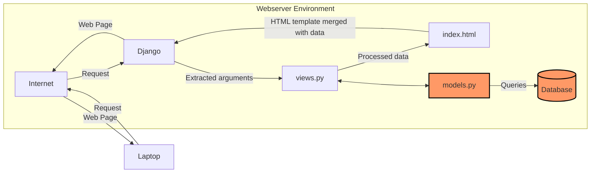

# Amajon

## Link tautan PWS dan masing-masing README.md tugas
- Link: http://athallah-damar-amajon.pbp.cs.ui.ac.id/

- [README.md Tugas 2](#Tugas-2)

- [README.md Tugas 3](#Tugas-3)

- [README.md Tugas 4](#Tugas-4)

# Tugas-2
## Jelaskan bagaimana cara kamu mengimplementasikan checklist di atas secara step-by-step (bukan hanya sekadar mengikuti tutorial).

### Membuat sebuah proyek Django baru
* Jalankan perintah berikut:
```shell
# MEBUAT DIREKTORI
mkdir amajon
cd amajon

# MEMBUAT ENVIRONMENT
python -m venv env

# INSTALL LIBRARIES
env\Script\activate
pip install django
pip install gunicorn
pip install whitenoise
pip install psycopg2-binary
pip install requests
pip install urllib3
pip freeze > requirements.txt
```
* Membuat `.gitignore`
* Membuat project
```
django-admin startproject amajon .
```

###  Membuat aplikasi dengan nama `main` pada proyek tersebut.
```
django-admin startapp main
```
Kemudian, menambahkan `ALLOWED_HOST` dalam `settings.py` agar dapat di _run_ secara lokal
```py
ALLOWED_HOSTS = ["127.0.0.1", "localhost"]
```

### Melakukan routing pada proyek agar dapat menjalankan aplikasi main.
* Menambahkan `main` pada `INSTALLED_APPS` dalam `settings.py`
```py
INSTALLED_APPS = [
...
'main'
]
```
### Membuat model pada aplikasi main dengan nama Product dan memiliki atribut wajib sebagai berikut: nama, price, description
Memodifikasi file `models.py`
```py
from django.db import models

# MENAMBAHKAN KODE DIBAWAH
class Product(models.Model):
    name = models.CharField(max_length=255)
    price = models.IntegerField()
    description = models.TextField()
    quantity = models.IntegerField()

    def __str__(self):
        return print(f"Name: {self.name}, Price: {self.price}, Stock: {self.stock}")
```

### Membuat sebuah fungsi pada `views.py` untuk dikembalikan ke dalam sebuah template HTML yang menampilkan nama aplikasi serta nama dan kelas kamu.
Memodifikasi `views.py`
```py
from django.shortcuts import render

# Create your views here.

def show_main(request):
    context = {
        'app': 'Amajon'
        'name': 'Athallah Damar Jiwanto',
        'class': 'PBP D'
    }

    return render(request, "main.html", context)
```
dan pada HTML menggunakan '{{}}'
```HTML
<!DOCTYPE html>
<html lang="en">
    <meta charset="UTF-8">
    <meta name="viewport" content="width=device-width, initial-scale=1.0">
    <title>Amajon.com</title>
    <h1>{{application_name}}</h1>

    <h5>NPM: </h5>
    <p>{{npm}}</p>
    <h5>Name: </h5>
    <p>{{nama}}</p>
    <h5>Class: </h5>
    <p>{{kelas}}</p>

</html>
```
### Membuat sebuah routing pada `urls.py` aplikasi main untuk memetakan fungsi yang telah dibuat pada `views.py`.
* Modifikasi `urls.py` pada direktori `main`
```py
from django.urls import path
from main.views import show_main

app_name = 'main'

urlpatterns = [
    path('', show_main, name='show_main'),
]
```
* Modifikasi `urls.py` pada direktori proyek
```py
from django.contrib import admin
from django.urls import path,include

urlpatterns = [
    path('admin/', admin.site.urls),
    path('', include('main.urls')),
]
```

### Melakukan deployment ke PWS terhadap aplikasi yang sudah dibuat sehingga nantinya dapat diakses oleh teman-temanmu melalui Internet.
* Kembali ke `settings.py`, menambahkan link sesuai format pws
```py
ALLOWED_HOSTS = ["127.0.0.1", "localhost", "athallah-damar-amajon.pbp.cs.ui.ac.id"]
```
* Menjalankan perintah berikut
```shell
git remote add origin https://github.com/AthallahD/amajon.git
git remote add pws http://pbp.cs.ui.ac.id/athallah.damar/amajon
git add .
git commit -m "init commit"
git branch -M main
git push -u origin main
git branch -M master
git push pws master
```
## Buatlah bagan yang berisi request client ke web aplikasi berbasis Django beserta responnya dan jelaskan pada bagan tersebut kaitan antara urls.py, views.py, models.py, dan berkas html.


_User_ mengirim _request_ melalui Internet, yang diterima oleh Django. Django memprosesnya di `views.py` dan, jika diperlukan, mengambil data dari `models.py` yang terhubung ke database. Lalu, data teresebut _merge_ dengan template HTML. Hasilnya, halaman web yang sudah terisi data dikirim kembali melalui Internet untuk ditampilkan di browser _user_.

## Jelaskan fungsi git dalam pengembangan perangkat lunak!
Fungsi git dalam pengembangan perangkat lunak sendiri adalah sebagai version control system. Fungsi utamanya adalah melacak perubahan kode sehingga dapat menyimpan versi-versi berbeda dari proyek tanpa harus menyimpan file duplikat secara manual.
## Menurut Anda, dari semua framework yang ada, mengapa framework Django dijadikan permulaan pembelajaran pengembangan perangkat lunak?
Framework Django sebagai permulaan pembelajaran adalah karena kemudahan dalam penggunaan terutama dalam penggunaan bahasa pemrograman Python. Selain itu pada Django terdapat banyak sekali fitur "Built-in" yang dapat dieksplor oleh pengguna. Pada Django sendiri, pola yang digunakan adalah MVT atau Model View Template yang membantu membagi tugas dalam aplikasi web dengan terstruktur dan logis.
## Mengapa model pada Django disebut sebagai ORM?
Model pada Django disebut ORM (Object-Relational Mapping) karena berfungsi sebagai penghubung antara objek di dalam kode Python dengan tabel di dalam database relasional. ORM mempermudah pekerjaan user dengan database tanpa perlu menulis SQL secara langsung sehingga user bisa berinteraksi dengan database menggunakan objek Python yang lebih intuitif.

# Tugas-3
## Jelaskan mengapa kita memerlukan data delivery dalam pengimplementasian sebuah platform?
Data delivery sangat penting dalam pengimplementasian platform karena platform modern umumnya melibatkan pertukaran data antara berbagai komponen seperti server, database, dan klien (user interface). Tanpa mekanisme data delivery yang baik, aplikasi tidak akan mampu menyajikan data secara real-time atau sesuai permintaan, yang dapat menyebabkan pengalaman pengguna yang buruk dan kesalahan komunikasi antara berbagai sistem. Data delivery memastikan bahwa data yang tepat sampai ke tujuan yang tepat dengan aman, cepat, dan konsisten.

## Menurutmu, mana yang lebih baik antara XML dan JSON? Mengapa JSON lebih populer dibandingkan XML?
JSON lebih baik untuk kebanyakan aplikasi modern karena beberapa alasan:

- Lebih ringan dan lebih ringkas: JSON menggunakan format yang lebih sederhana dan lebih hemat tempat dibandingkan XML, yang biasanya membutuhkan lebih banyak tag untuk mendefinisikan data.
- Lebih mudah dibaca manusia dan mesin: Struktur JSON mirip dengan objek dalam bahasa pemrograman seperti JavaScript, sehingga lebih mudah dipahami dan diolah oleh developer.
- Lebih cepat diproses: Karena JSON lebih ringan, ini memungkinkan parsing yang lebih cepat, yang sangat penting dalam aplikasi web modern yang membutuhkan kecepatan tinggi. Oleh karena itu, JSON lebih populer dibandingkan XML terutama dalam pengembangan aplikasi web dan API modern.

## Jelaskan fungsi dari method `is_valid()` pada form Django dan mengapa kita membutuhkan method tersebut?
Method `is_valid()` digunakan pada form Django untuk memvalidasi data yang dikirimkan oleh user melalui form. Ketika method ini dipanggil, Django akan:

- Memeriksa apakah semua field dalam form telah diisi sesuai dengan aturan validasi yang telah ditetapkan (misalnya, memastikan bahwa input email berbentuk email, atau bahwa suatu field angka memang diisi dengan angka).
- Mengembalikan True jika data valid, atau False jika ada kesalahan. Method ini penting karena membantu memastikan bahwa data yang dikirimkan user benar sebelum diproses lebih lanjut (misalnya disimpan ke database).

## Mengapa kita membutuhkan `csrf_token` saat membuat form di Django? Apa yang dapat terjadi jika kita tidak menambahkan `csrf_token` pada form Django? Mengapa kita membutuhkan csrf_token saat membuat form di Django? Apa yang dapat terjadi jika kita tidak menambahkan csrf_token pada form Django?
`csrf_token` digunakan untuk melindungi form di Django dari serangan `Cross-Site Request Forgery (CSRF)`. Serangan CSRF adalah jenis serangan di mana penyerang dapat membuat user yang telah login di suatu situs mengirimkan permintaan yang tidak diinginkan ke server. Jika kita tidak menambahkan `csrf_token`:

- Penyerang dapat memanfaatkan kelemahan ini untuk melakukan tindakan yang tidak diinginkan atas nama user tanpa sepengetahuan mereka, misalnya, mengubah pengaturan akun atau melakukan transaksi tanpa persetujuan. Dengan menambahkan csrf_token, setiap form akan memiliki token unik yang harus cocok dengan yang disimpan di sesi user. Ini mencegah penyerang dari mengirimkan permintaan palsu karena mereka tidak akan memiliki token yang valid.

## Jelaskan bagaimana cara kamu mengimplementasikan checklist di atas secara step-by-step
- Membuat `base.html` pada subdirektori bernama `templates` pada direktori root
```HTML

<!DOCTYPE html>
<html lang="en">
  <head>
    <meta charset="UTF-8" />
    <meta name="viewport" content="width=device-width, initial-scale=1.0" />
     
  </head>

  <body>
     
  </body>
</html>
```

- Menambahkan line code pada `settings.py` pada bagian `TEMPLATES` agar `base.html` terbaca
```py
TEMPLATES = [
    {
        'BACKEND': 'django.template.backends.django.DjangoTemplates',
        'DIRS': [BASE_DIR / 'templates'],
        'APP_DIRS': True,
        'OPTIONS': {
            'context_processors': [
                'django.template.context_processors.debug',
                'django.template.context_processors.request',
                'django.contrib.auth.context_processors.auth',
                'django.contrib.messages.context_processors.messages',
            ],
        },
    },
]
```

- Memodifikasi `main.html` pada subdirektori `templates` pada direktori `main` agar bisa meng-extend `base.html`
```HTML


<h1>{{ application_name }}</h1>

<h2>Amajon is one of the largest e-commerce in Indonesia</h2>
<h5>NPM: </h5>
<p>{{ npm }}<p>

<h5>Name:</h5>
<p>{{ nama }}</p>

<h5>Class:</h5>
<p>{{ kelas }}</p>


    <p>Belum ada data product pada toko amajon.</p>

    <table>
    <tr>
        <th>Product Name</th>
        <th>Price</th>
        <th>Description</th>
        <th>Quantity</th>
    </tr>

    
        <tr>
            <td>{{products_entry.name}}</td>
            <td>{{products_entry.price}}</td>
            <td>{{products_entry.description}}</td>
            <td>{{products_entry.quantity}}</td>
        </tr>

</table>


<br />

<a href="">
  <button>Add New Product Entry</button>
</a>

```

- Membuat `forms.py` untuk membuat suatu form dan import form pada `views.py`
```py
from django.forms import ModelForm
from main.models import Product

class ProductForm(ModelForm):
    class Meta:
        model = Product
        fields = ["name", "price", "description", "quantity"]
```

- Menambahkan fungsi pada `views.py` dan memodifikasi fungsi di dalamnya
```py
from django.shortcuts import render, redirect
from main.forms import ProductForm
from main.models import Product
from django.http import HttpResponse
from django.core import serializers

def show_main(request):
    product_entries = Product.objects.all()

    context = {
        'application_name' : 'Amajon',
        'nama': 'Athallah Damar Jiwanto',
        'npm': '2306245024',
        'kelas': 'PBP D',
        'products': product_entries
    }

    return render(request, "main.html", context)

def create_product_entry(request):
    form = ProductForm(request.POST or None)

    if form.is_valid() and request.method == "POST":
        form.save()
        return redirect('main:show_main')

    context = {'form': form}
    return render(request, "create_product_entry.html", context)

def show_xml(request):
    data = Product.objects.all()
    return HttpResponse(serializers.serialize("xml", data), content_type="application/xml")

def show_json(request):
    data = Product.objects.all()
    return HttpResponse(serializers.serialize("json", data), content_type="application/json")

def show_xml_by_id(request, id):
    data = Product.objects.filter(pk=id)
    return HttpResponse(serializers.serialize("xml", data), content_type="application/xml")

def show_json_by_id(request, id):
    data = Product.objects.filter(pk=id)
    return HttpResponse(serializers.serialize("json", data), content_type="application/json")
```

- Membuat `create_product_entry.html` agar dapat menambahkan product
```HTML
 

<h1>Add New Product</h1>

<form method="POST">

<table>
  {{ form.as_table }}
  <tr>
  <td></td>
  <td>
    <input type="submit" value="Add Product Entry" />
  </td>
  </tr>
</table>
</form>


```

- Menambahkan path pada `urls.py`
```py
from django.urls import path
from main.views import show_main, create_product_entry, show_xml, show_json, show_json_by_id, show_xml_by_id

app_name = 'main'

urlpatterns = [
    path('', show_main, name='show_main'),
    path('create-product-entry', create_product_entry, name='create_product_entry'),
    path('xml/', show_xml, name='show_xml'), 
    path('json/', show_json, name='show_json'),
    path('xml/<str:id>', show_xml_by_id, name='show_xml_by_id'),
    path('json/<str:id>', show_json_by_id, name='show_json_by_id'),    
]
```

## Mengakses keempat URL di poin 2 menggunakan `Postman`, membuat screenshot dari hasil akses URL pada Postman, dan menambahkannya ke dalam README.md
- XML

- JSON

- XML by id

- JSON by id


# Tugas-4
## Apa perbedaan antara `HttpResponseRedirect()` dan `redirect()`
1. `HttpsResponseRedirect()`
- Fungsi: HttpResponseRedirect adalah sebuah class di Django yang digunakan untuk melakukan redirect secara manual dengan menentukan URL tujuan sebagai parameter.
- Cara Kerja: menyediakan URL tujuan secara eksplisit, baik sebagai string atau URL yang dibentuk dari fungsi lain.
- Contoh Penggunaan :
```py
def login_user(request):
   if request.method == 'POST':
      form = AuthenticationForm(data=request.POST)

      if form.is_valid():
        user = form.get_user()
        login(request, user)
        response = HttpResponseRedirect(reverse("main:show_main"))
        response.set_cookie('last_login', str(datetime.datetime.now()))
        return response

   else:
      form = AuthenticationForm(request)
   context = {'form': form}
   return render(request, 'login.html', context)
```
dengan `(reverse("main:show_main"))` sebagai URL tujuan

2. `redirect()`
- Fungsi: redirect() adalah shortcut (fungsi bawaan Django) yang lebih mudah digunakan dibandingkan HttpResponseRedirect. Selain menerima URL tujuan, redirect() juga dapat menerima nama view atau model instance, yang kemudian akan diubah secara otomatis menjadi URL yang tepat.
- Cara Kerja: Lebih fleksibel karena dapat memberikan view name, model object, atau URL secara langsung.
- Contoh penggunaan :
```py
def register(request):
    form = UserCreationForm()

    if request.method == "POST":
        form = UserCreationForm(request.POST)
        if form.is_valid():
            form.save()
            messages.success(request, 'Your account has been successfully created!')
            return redirect('main:login')
    context = {'form':form}
    return render(request, 'register.html', context)
```
dengan `"main:login"` sebagai URL tujuan

## Jelaskan cara kerja penghubungan model `Product` dengan `User`!
`Product` diberikan attribute ForeignKey `User` sehingga tercipta hubungan _Many to One_. `User` pada Django didapatkan dari models package `django.contrib.auth.models`. Untuk melakukan filtering pada object `Product`, tambahkan kode berikut :
```py
class Product(models.Model):
    user = models.ForeignKey(User, on_delete=models.CASCADE)
```

## Apa perbedaan antara authentication dan authorization, apakah yang dilakukan saat pengguna login? Jelaskan bagaimana Django mengimplementasikan kedua konsep tersebut.
1. `Authentication` (Otentikasi)
- Definisi : Authentication adalah proses memverifikasi identitas pengguna. Ini melibatkan memastikan bahwa pengguna adalah siapa yang mereka klaim, biasanya dengan memeriksa kredensial seperti username dan password.
- Contoh : Saat pengguna memasukkan username dan password untuk masuk ke suatu aplikasi, aplikasi tersebut memeriksa apakah kredensial tersebut benar dan sesuai dengan yang ada di database.

2. `Authorization` (Otorisasi)
- Definisi: Authorization adalah proses memeriksa hak akses pengguna. Setelah pengguna terotentikasi, otorisasi menentukan apakah mereka memiliki izin untuk mengakses sumber daya atau melakukan tindakan tertentu.
- Contoh: Setelah pengguna login, sistem kemudian memeriksa apakah pengguna tersebut memiliki izin untuk melihat halaman admin atau melakukan tindakan seperti mengedit, menghapus data, dsb.

### Perbedaan Utama
- `Authentication` berkaitan dengan memverifikasi identitas pengguna
- `Authorization` berkaitan dengan memeriksa izin setelah diidentifikasi

### Proses saat login
- Authentication (Otentikasi): Aplikasi memeriksa kredensial yang dimasukkan (seperti username dan password) dengan data yang ada di database untuk memverifikasi identitas pengguna.
- Jika identitas terverifikasi, pengguna kemudian diotentikasi, yang artinya sistem mengenali siapa pengguna itu.
- Setelah pengguna terotentikasi, aplikasi dapat melakukan authorization (otorisasi) dengan memeriksa apakah pengguna tersebut memiliki izin yang diperlukan untuk mengakses sumber daya tertentu.

### Implementasi pada Django
#### `Authentication` (Otentikasi) di Django:
- Django menggunakan User model bawaan untuk mengelola pengguna.
- Proses otentikasi biasanya dilakukan melalui sistem login, di mana Django memeriksa apakah pengguna dengan username dan password yang diberikan ada dan kredensialnya benar.
- Fungsi authenticationForm() memiliki tujuan yang sama dengan authenticate() namun
perbedaannya ada di import dan khusus digunakan untuk otentikasi form digunakan untuk memeriksa kredensial :
```py
def login_user(request):
   if request.method == 'POST':
      form = AuthenticationForm(data=request.POST)

      if form.is_valid():
        user = form.get_user()
        login(request, user)
        response = HttpResponseRedirect(reverse("main:show_main"))
        response.set_cookie('last_login', str(datetime.datetime.now()))
        return response

   else:
      form = AuthenticationForm(request)
   context = {'form': form}
   return render(request, 'login.html', context)
```
#### `Authorization` (Otorisasi) di Django :
- Django menggunakan permissions dan groups untuk otorisasi. Permissions mengontrol apa yang bisa dilakukan pengguna, seperti can_add, can_change, dan can_delete untuk objek tertentu.
- Django juga memiliki mekanisme otorisasi berbasis objek, di mana akses dapat diberikan berdasarkan kepemilikan atau kriteria lain.
- Decorator @login_required: Django menyediakan decorator yang memastikan bahwa hanya pengguna yang sudah terotentikasi yang dapat mengakses view tertentu.
```py
@login_required(login_url='/login')
```
## Bagaimana Django mengingat pengguna yang telah login? Jelaskan kegunaan lain dari cookies dan apakah semua cookies aman digunakan?

Django menggunakan session dan cookies untuk mengingat pengguna yang telah login. Proses ini dapat dijelaskan dalam beberapa langkah:
1. Login dan Otentikasi
- Ketika pengguna login menggunakan kredensial mereka (username dan password), Django memverifikasi kredensial tersebut menggunakan mekanisme otentikasi, seperti `authenticate()` dan `login()`. Jika kredensialnya benar, pengguna dianggap terotentikasi.
2. Session dan Cookies
- Setelah login berhasil, Django membuat session untuk pengguna. Session ini adalah penyimpanan sementara di server yang digunakan untuk melacak informasi tentang pengguna selama sesi (misalnya, pengguna telah login).
- Django kemudian mengirimkan sebuah cookie ke browser pengguna. Cookie ini berisi session ID yang unik dan bertindak sebagai referensi antara pengguna dan session mereka di server.
3. Penyimpanan session
- Session ID yang terkandung dalam cookie adalah kunci untuk mencocokkan pengguna dengan session yang tersimpan di server. Django dapat menyimpan data session di berbagai tempat, seperti dalam database, file, atau cache.
- Setiap kali pengguna mengirim permintaan baru ke server (misalnya, membuka halaman baru setelah login), Django akan memeriksa cookie yang dikirim oleh browser. Jika cookie tersebut valid dan cocok dengan session di server, pengguna dianggap telah login dan Django akan "mengingat" mereka.
4. `login()` dan `logout()`
- Fungsi `login()` Django mengaitkan session dengan pengguna. Ini berarti Django akan menyimpan informasi pengguna yang terotentikasi dalam session dan mengirimkan session ID kembali ke browser dalam bentuk cookie.
- Fungsi `logout()` digunakan untuk menghapus session dan cookie dari pengguna sehingga mereka tidak lagi dianggap login.

### Kegunaan lain cookies
Cookies memiliki berbagai kegunaan dalam pengembangan web selain untuk mengelola session pengguna yang telah login:

1. Menyimpan Preferensi Pengguna: Cookies bisa digunakan untuk menyimpan preferensi pengguna, seperti pengaturan bahasa, tema, atau preferensi lain yang terkait dengan pengalaman pengguna.

2. Pelacakan Pengguna (Tracking): Cookies sering digunakan oleh layanan analitik atau pengiklan untuk melacak aktivitas pengguna di berbagai situs web. Ini memungkinkan pengumpulan data mengenai kebiasaan dan perilaku pengguna di internet.

3. Otentikasi Berkelanjutan (Remember Me): Cookies juga digunakan untuk menyimpan informasi login yang bersifat persisten (misalnya, opsi "Ingat Saya"). Dengan cara ini, pengguna tidak perlu login setiap kali mengunjungi situs.

4. Personalisasi Iklan: Cookies sering digunakan oleh pengiklan untuk menargetkan iklan yang sesuai dengan preferensi dan aktivitas online pengguna. Ini berdasarkan data yang dikumpulkan dari riwayat penjelajahan pengguna.

### Apakah semua cookies aman digunakan?
Tidak semua cookies aman, dan ada beberapa risiko serta perhatian terkait keamanan cookies:

1. Cookie yang Aman (Secure Cookies):

- Django menyediakan opsi untuk membuat secure cookies, yaitu cookies yang hanya akan dikirim melalui koneksi HTTPS. Ini mengurangi risiko penyadapan (sniffing) oleh pihak ketiga.
- Penggunaan flag Secure pada cookie memastikan bahwa cookie hanya dikirim melalui koneksi yang aman.
- Flag HttpOnly membuat cookie tidak bisa diakses oleh JavaScript, sehingga melindungi cookie dari serangan cross-site scripting (XSS).

2. Cross-Site Scripting (XSS):

- Cookies yang tidak aman bisa dicuri melalui serangan XSS. Ini terjadi jika attacker berhasil memasukkan skrip berbahaya ke dalam situs yang kemudian bisa mengakses cookie pengguna. Menggunakan flag `HttpOnly` bisa mencegah serangan ini.

3. Cross-Site Request Forgery (CSRF):

- CSRF adalah serangan di mana attacker memanipulasi pengguna yang terotentikasi untuk melakukan aksi yang tidak mereka kehendaki. Django melindungi dari CSRF dengan menggunakan token CSRF di form, tetapi cookies bisa digunakan untuk meluncurkan serangan CSRF jika tidak diatur dengan baik.

4. Session Hijacking:

- Jika attacker mencuri session ID (biasanya dari cookie), mereka dapat mengakses session pengguna dan bertindak seolah-olah mereka adalah pengguna tersebut. Oleh karena itu, penting untuk mengamankan cookie yang berisi session ID.

5. Cookie Expiration:

- Cookies bisa disetel agar memiliki masa kadaluarsa. Cookie yang tidak memiliki masa kadaluarsa yang tepat bisa disalahgunakan oleh attacker.

## Jelaskan bagaimana cara kamu mengimplementasikan checklist di atas secara step-by-step (bukan hanya sekadar mengikuti tutorial).

### Implementasi _Authentication_ pada `views`
- Menambahkan beberapa imports
```py
import datetime
from django.shortcuts import render, redirect
from main.forms import ProductForm
from main.models import Product
from django.http import HttpResponse
from django.core import serializers
from django.contrib.auth.forms import UserCreationForm, AuthenticationForm
from django.contrib import messages
from django.contrib.auth import login, logout, authenticate, logout
from django.contrib.auth.decorators import login_required
from django.http import HttpResponseRedirect
from django.urls import reverse
```
- Menambahkan Method `Register`, `login`, `logout`
```py
def register(request):
    form = UserCreationForm()

    if request.method == "POST":
        form = UserCreationForm(request.POST)
        if form.is_valid():
            form.save()
            messages.success(request, 'Your account has been successfully created!')
            return redirect('main:login')
    context = {'form':form}
    return render(request, 'register.html', context)

def login_user(request):
   if request.method == 'POST':
      form = AuthenticationForm(data=request.POST)

      if form.is_valid():
        user = form.get_user()
        login(request, user)
        response = HttpResponseRedirect(reverse("main:show_main"))
        response.set_cookie('last_login', str(datetime.datetime.now()))
        return response

   else:
      form = AuthenticationForm(request)
   context = {'form': form}
   return render(request, 'login.html', context)

def logout_user(request):
    logout(request)
    response = HttpResponseRedirect(reverse('main:login'))
    response.delete_cookie('last_login')
    return response
```
- Meng-Update `show_main` dan `create_product_entry`
```py
def show_main(request):
    product_entries = Product.objects.filter(user=request.user)

    context = {
        'application_name' : 'Amajon',
        'nama': request.user.username,
        'npm': '2306245024',
        'kelas': 'PBP D',
        'products': product_entries,
        'last_login': request.COOKIES.get('last_login'),
    }

    return render(request, "main.html", context)

def create_product_entry(request):
    form = ProductForm(request.POST or None)

    if form.is_valid() and request.method == "POST":
        product_entry = form.save(commit=False)
        product_entry.user = request.user
        product_entry.save()
        return redirect('main:show_main')

    context = {'form': form}
    return render(request, "create_product_entry.html", context)
```
- Membuat templates `login.html` dan `logout.html`
```HTML



<title>Register Your Account</title>




<div class="login">
  <h1>Register</h1>

  <form method="POST">
    
    <table>
      {{ form.as_table }}
      <tr>
        <td></td>
        <td><input type="submit" name="submit" value="Daftar" /></td>
      </tr>
    </table>
  </form>

  
  <ul>
    
    <li>{{ message }}</li>
    
  </ul>
  
</div>


```
```HTML



<title>Login</title>



<div class="login">
  <h1>Login</h1>

  <form method="POST" action="">
    
    <table>
      {{ form.as_table }}
      <tr>
        <td></td>
        <td><input class="btn login_btn" type="submit" value="Login" /></td>
      </tr>
    </table>
  </form>

  
  <ul>
    
    <li>{{ message }}</li>
    
  </ul>
   Don't have an account yet?
  <a href="">Register Now</a>
</div>


```
- Menghubungkan `Product` dengan `User` melalui `models.py`
```py
class Product(models.Model):
    user = models.ForeignKey(User, on_delete=models.CASCADE) # Tambahan Line
    id = models.UUIDField(primary_key=True, default=uuid.uuid4, editable=False)
    name = models.CharField(max_length=255)
    price = models.IntegerField()
    description = models.TextField()
    quantity = models.IntegerField()

    def __str__(self):
        return print(f"Name: {self.name}, Price: {self.price}, Stock: {self.stock}")
```
### Authorization
Mengharuskan user untuk login terlebih dahulu sebelum masuk ke dalam homepage, sehingga kita harus menambahkan decorators `@login_required` dari `django.contrib.auth.decorators` pada `views.py` diatas method `show_main`
```py
@login_required(login_url='/login') # Authorization
def show_main(request):
```
### Finishing
Tambahkan endpoints url pada `urlpatterns` pada `urls.py` yang terletak pada folder `main`
```py
from django.urls import path
from main.views import show_main, create_product_entry, show_xml, show_json, show_json_by_id, show_xml_by_id, register, login_user, logout_user

app_name = 'main'

urlpatterns = [
    path('', show_main, name='show_main'),
    path('create-product-entry', create_product_entry, name='create_product_entry'),
    path('xml/', show_xml, name='show_xml'), 
    path('json/', show_json, name='show_json'),
    path('xml/<str:id>', show_xml_by_id, name='show_xml_by_id'),
    path('json/<str:id>', show_json_by_id, name='show_json_by_id'),
    path('register/', register, name='register'),
    path('login/', login_user, name='login'),
    path('logout/', logout_user, name='logout')
]
```